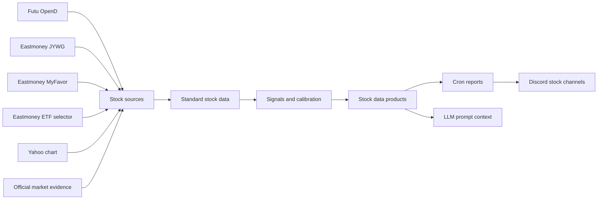

# Stock Data System

> 结论：stock 文档现在按数据系统组织，而不是按 provider 文件夹树组织。数据源负责抓取原始事实，`src/stock/data` 和 `src/stock/signals` 负责标准化与打分，`src/stock/reports` 负责生成 task-ready product，cron/provider wrapper 只保留 MiniClaw runtime 兼容层。

## 系统地图



## 文档集合

- [`../../../providers/stock/data-and-sources.md`](../../../providers/stock/data-and-sources.md)：trusted sources、session boundary、source reliability 和标准化 stock data semantics。
- [`../../../providers/stock/workflows.md`](../../../providers/stock/workflows.md)：stock data products，以及当前使用它们的 cron workflows。
- [`../../../providers/stock/operations-and-security.md`](../../../providers/stock/operations-and-security.md)：health check、refresh command、安全规则和常见恢复路径。
- [`../../../plans/2026-05-17-stock-provider-data-layer-migration.md`](../../../plans/2026-05-17-stock-provider-data-layer-migration.md)：data-layer-first 架构的历史迁移计划。

## Runtime 分层

```text
src/stock/
  sources/   # external Futu, Eastmoney, Yahoo, and official evidence adapters
  data/      # calendar, universe, quotes, portfolio, ETF premium, market evidence, market memory
  signals/   # pulse anomaly, market-intel scoring, forecast evaluation, calibration
  reports/   # cron-facing stock report composers and prompt payload renderers
  types.ts   # vendor-neutral stock domain types
```

stock provider 的 `src/providers/*/index.ts` 是 compatibility wrapper。它们 re-export `src/stock/reports/*` 的 report composer，让已有 cron YAML 可以继续使用 `pre_provider`、`pre_provider_config` 和 `pre_context_providers`。

这个边界是刻意保留的：

- `src/stock/sources/*`、`src/stock/data/*` 和 `src/stock/signals/*` 不 import stock-specific provider modules。
- `src/stock/reports/*` 可以 import provider config loaders 和 provider framework types，因为 reports 是 cron-facing product layer。
- `src/providers/<stock-provider>/config.ts` 仍然是 `~/.miniclaw/providers/**` 本地命名配置的 loader。
- provider tests 和 fixtures 可以继续留在 `src/providers/**/__tests__` 或 `fixtures/` 下，用来验证 runtime compatibility。

## 数据产品

当前 stock products 包括：

- `stock-portfolio`：把 readonly broker/account evidence 合成为 redacted portfolio 和 asset summaries。
- `stock-pulse`：扫描持仓和 watchlist symbols 的 intraday movement 与 anomaly signals。
- `market-intel`：采集 market evidence、quote context、portfolio context 和 calibrated market scores。
- `market-context`：存储并注入 rolling multi-day market memory。
- `market-forecast-evaluation`：对 stored market forecasts 和 benchmark outcomes 做评估。
- `stock-watchlist-research`：研究 broker watchlist 中尚未持有的 symbols。

## 核心规则

- holdings 和 watchlist symbols 是不同数据类型。
- public ETF premium data 可以按代码 enrich 已持仓 ETF，但不能证明账户持有。
- market context 是 memory，不是实时 quote source。
- forecast evaluations 是 calibration telemetry，不是交易指令。
- stock provider 不能 unlock trading、place orders、modify orders、transfer funds 或绕过 login challenges。

## 验证

```bash
pnpm vitest run src/providers/stock-portfolio src/providers/stock-pulse src/providers/market-intel src/providers/market-context src/providers/market-forecast-evaluation src/providers/stock-watchlist-research
pnpm vitest run src/mcp/futu-stock src/mcp/eastmoney-jywg src/mcp/eastmoney-myfavor src/providers/futu-stock src/providers/eastmoney-jywg-readonly src/providers/eastmoney-etf-premium
pnpm run quality:docs
pnpm run typecheck
```
