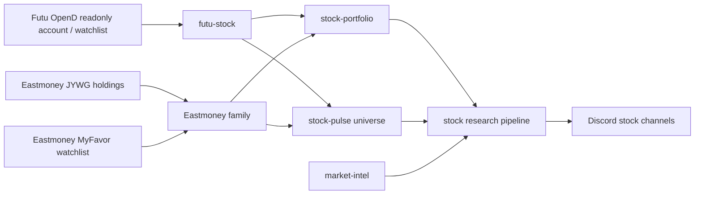

# Stock Provider Family

> 结论：stock provider docs 描述只读券商/account source、watchlist source、market evidence 和 research workflow。账户专属 session 和私有券商细节不能出现在 public website pages。

## Data Flow



## Canonical Docs

- [`../../../providers/stock/eastmoney.md`](../../../providers/stock/eastmoney.md): JYWG holdings 和 MyFavor watchlist 的 Eastmoney family boundary。
- [`../../../providers/stock/research.md`](../../../providers/stock/research.md): 横跨 portfolio、pulse、market-intel 和 watchlist research 的 stock research provider pipeline。

## Futu Stock Provider

Runtime names:

- MCP server: `futu-stock`.
- Cron pre-provider: `futu-stock`.
- Stock-pulse universe source: `futu_watchlist`.

Owner code paths:

```text
src/mcp/futu-stock/
  server.ts        # stdio MCP server with readonly tools
  config.ts        # ~/.miniclaw/providers/futu-stock/config.yaml
  futu-client.ts   # Python bridge to official futu-api / moomoo package
  mapper.ts        # Futu fields -> unified account snapshot
  redact.ts        # prompt/Discord-safe redaction
  safety.ts        # readonly tool and forbidden API checks
  state.ts
  types.ts

src/providers/futu-stock/
  index.ts         # cron pre_provider entry
  config.ts        # ~/.miniclaw/providers/futu-stock/<name>.yaml
  format.ts        # safe context formatter
```

Trusted source:

- 通过本机 OpenD 访问 Futu / moomoo 官方 OpenAPI。
- OpenD 应只监听 `127.0.0.1`。
- MiniClaw 通过官方 Python SDK bridge 访问 OpenD；不保存 Futu account password 或 trading password。

Command:

```bash
pnpm mcp:futu-stock
```

Readonly tools:

- `futu_health_check`
- `futu_get_account_snapshot`
- `futu_get_positions_summary`
- `futu_get_daily_pnl_report`

Forbidden behavior:

- `unlock_trade`
- `place_order`
- `modify_order`
- automatic trading、strategy trading、fund transfer 或任何 trade-password workflow
- 把 account IDs、phone numbers、tokens、raw SDK session data 或 OpenD credentials 暴露到 logs/Discord/LLM prompts

Provider usage:

```yaml
pre_provider: futu-stock
pre_provider_config: us-stock
```

Stock-pulse universe source usage:

```yaml
universe:
  include_sources: true
  sources:
    - type: futu_watchlist
      name: futu-us-watchlist
      market: us
      profile: us
      groups: ["Favorites"]
      limit: 80
```

Futu watchlist rows 是 observation-universe symbols。除非它们同时来自 portfolio/account provider payload，否则不能渲染为 account holdings。

## Provider Boundaries

- Holdings 和 watchlists 是不同 source types。
- Account providers 可以 feed `stock-portfolio`；watchlist sources 可以 feed `stock-pulse` 和 watchlist research。
- Provider code 应在 LLM interpretation 前计算 deterministic evidence。
- Public website pages 可以总结 stock capabilities，但实现事实应通过 `source_docs` 回链到本目录。

## Legacy Compatibility

旧 Futu feature doc 会作为兼容 stub 保留一个迁移周期：

- [`../../../features/06-futu-stock.md`](../../../features/06-futu-stock.md)

Stock research legacy stubs 列在 [`../../../providers/stock/research.md`](../../../providers/stock/research.md#legacy-compatibility)。

Verification owner:

```bash
pnpm vitest run src/mcp/futu-stock src/providers/futu-stock
pnpm run quality:docs
pnpm run typecheck
```
