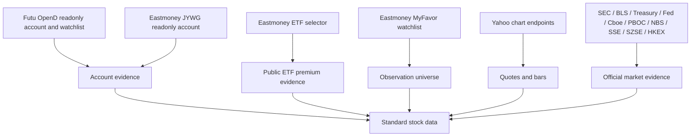

# Stock Data And Sources

> 结论：stock 系统先把外部集成视为 data sources。每个 source 在进入 cron report 或 LLM prompt 之前，都必须先明确 trust boundary、session model 和 business meaning。

## Source Map



## Broker Account Sources

Futu OpenD:

- Runtime names: `futu-stock` MCP server 和 `futu-stock` cron pre-provider。
- Trusted source: 通过本地 OpenD 调用 official Futu / moomoo OpenAPI。
- Code paths: `src/mcp/futu-stock/**`、`src/stock/sources/futu/**`、`src/stock/reports/futu-stock*.ts`。
- Business meaning: account snapshot、positions summary、daily P&L 和可选 watchlist symbols。
- Session model: MiniClaw 只连接本地 OpenD，不保存 Futu account password 或 trading password。
- Watchlist rows 只是 observation-universe symbols，除非同一 symbol 也出现在 account payload 中。

Eastmoney JYWG:

- Runtime names: `eastmoney-jywg` MCP server 和 `eastmoney-jywg-readonly` cron pre-provider。
- Trusted source: `jywg.18.cn` readonly account pages 和 readonly query endpoints。
- Code paths: `src/mcp/eastmoney-jywg/**`、`src/stock/sources/eastmoney/**`、`src/stock/reports/eastmoney-jywg-readonly*.ts`。
- Business meaning: account holdings、account summary、position evidence 和 holdings 返回的 premium fields。
- Session model: dedicated browser bootstrap、`~/.miniclaw/secrets/eastmoney-jywg-session.json`、atomic `0600` writes。
- Refresh model: `pnpm auth:refresh -- --provider eastmoney-jywg` 只读取 `/Trade/Buy` 作为 liveness proof，不查询 holdings、orders、deals 或 totals。

## Watchlist Sources

Futu watchlist:

- Source type: `futu_watchlist`。
- Trusted source: 通过 official SDK bridge 读取本地 Futu OpenD watchlist groups。
- Downstream use: `stock-pulse.universe.sources` 和 watchlist research。
- Business meaning: observation universe only。

Eastmoney MyFavor:

- Source type: `eastmoney_myfavor_watchlist`。
- Trusted source: `myfavor.eastmoney.com` readonly group 和 securities endpoints。
- Code paths: `src/mcp/eastmoney-myfavor/**`、`src/stock/sources/watchlists.ts`、`src/stock/data/universe.ts`。
- Downstream use: `stock-pulse.universe.sources` 和 `stock-watchlist-research`。
- Session model: 独立 MyFavor browser bootstrap 和独立 `~/.miniclaw/secrets/eastmoney-myfavor-session.json`。
- Business boundary: MyFavor symbols 不能进入 `stock-portfolio`，也不能被渲染成 account holdings。

## Market And Public Sources

Eastmoney ETF selector:

- Runtime name: `eastmoney-etf-premium`。
- Trusted source: 按 ETF code 查询 Eastmoney public fund selector endpoint。
- Code paths: `src/stock/sources/eastmoney/etf-premium-client.ts`、`src/stock/data/etf-premium*.ts`、`src/stock/reports/eastmoney-etf-premium.ts`。
- Business meaning: public ETF discount/premium evidence only。
- Portfolio rule: 可以按 exact code enrich 已存在的 JYWG-held ETF，但永远不能证明账户持有。
- Field contract: raw `PREMIUM_DISCOUNT_RATIO` 保留为 `eastmoney_discount_ratio`；MiniClaw 输出 `premium_rate = 0 - PREMIUM_DISCOUNT_RATIO`。

ETF/index look-through sources:

- Runtime use: private portfolio reports 可选配置 `stock-portfolio.equity_lookthrough_sources`。
- Trusted source: provider runtime 按配置拉取公开 issuer 或 index holdings endpoints。
- Supported shapes: HTTP JSON、CSV 和 XLSX tables，通过配置指定 company、ticker 和 weight columns。
- Business meaning: 只用于把 already-held ETF/index positions 展开成 single-stock exposure，永远不能证明账户持有。
- Failure policy: source failures、HTML/consent pages、empty tables 或 parse drift 都进入 warnings；MiniClaw 不能 fallback 到过期 hardcoded index weights。
- Identity rule: static aliases 可以归并同一公司的 share classes 或 A/H lines，但 alias 不能包含 weight data。

Yahoo chart endpoints:

- Code paths: `src/stock/sources/yahoo/**`、`src/stock/data/market-quotes.ts`、`src/stock/data/quotes.ts`。
- Downstream use: `stock-pulse`、`market-intel`、`market-forecast-evaluation` 和 watchlist research。
- Source tier: 根据产品语境作为 fallback 或 public market quote evidence。
- Failure policy: 产品可以安全继续时，quote failures 会进入 warnings 或 controlled skips。

Official market evidence:

- Default sources 包括 SEC、BLS、Treasury、Federal Reserve、Cboe history、PBOC、NBS、SSE、SZSE、HKEX，以及权限允许时的 Futu OpenD。
- Optional sources 包括本地 credential 存在时的 FRED API、Polygon 和 Tushare。
- Code paths: `src/stock/sources/official/**`、`src/stock/data/market-evidence.ts`。
- Downstream use: `market-intel` 和可选的 watchlist research market context。

## Standard Data Semantics

Holdings:

- 只能来自 account providers，比如 Futu account snapshots 和 Eastmoney JYWG holdings。
- 可以包含 quantity、market value、cost、P&L、allocation category 和 premium evidence。
- 经过 redaction 后可以出现在 private stock channels。

Watchlist symbols:

- 来自 Futu watchlists、Eastmoney MyFavor、Yahoo screeners、Eastmoney public lists 或 manual config。
- 表示 observation universe，不表示 ownership。
- watchlist research 中必须排除 already-held symbols。

Portfolio summaries:

- 由 `stock-portfolio` 基于 readonly account sources 构建。
- 可以包含 `cny_summary`、`asset_summary`、`position_premium_summary`、source status 和 warnings。
- `include_asset_totals: false` 用来避免 integrated broker accounts 或 enrichment-only public sources 被重复计入。

Quote bars and benchmarks:

- 用于 pulse anomaly scoring、market-intel snapshots 和 forecast evaluation。
- 必须携带 capture time、provider symbol、source tier，并在使用 fallback source 时保留 degradation warnings。

Market evidence:

- 结构化 evidence 需要包含 source IDs、capture time、freshness、source tier 和 scoring inputs。
- LLM reports 应引用 evidence IDs，而不是编造无支撑理由。

Market memory:

- 通过 `market_context_daily` 和 `market_context_items` 存储。
- 作为 background context 注入，不能覆盖更新鲜的 provider evidence。

Forecast records:

- 存储在 `market_forecasts`、`market_forecast_items` 和 `market_forecast_evaluations`。
- Same-day forecast scoring 需要明确的 same-day probabilities。
- Horizon-only forecasts 按设计跳过 same-day hit/miss 和 Brier evaluation。

## Data Ownership

```text
src/stock/sources/   # adapters and upstream client boundaries
src/stock/data/      # normalized data structures and deterministic builders
src/stock/signals/   # scoring, anomaly detection, forecast evaluation, calibration
src/stock/reports/   # task-ready payloads, prompt formatting, and attachments
```

Provider config loaders 仍保留在 `src/providers/<name>/config.ts`，因为本地 runtime configuration 仍按 provider name 命名。
