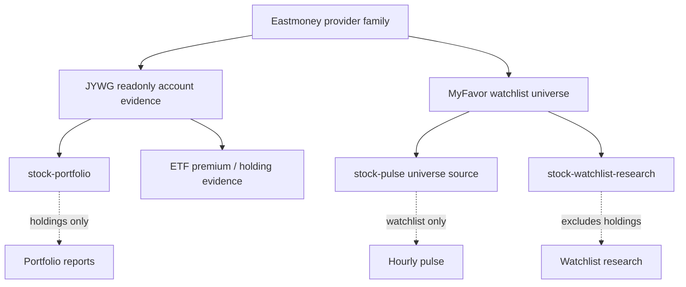

# Eastmoney Provider Family

> 结论：Eastmoney 现在作为一个 provider family 维护，但包含两个独立 runtime boundaries。`eastmoney-jywg-readonly` 从 `jywg.18.cn` 读取 JYWG account evidence；`eastmoney-myfavor` 从 `myfavor.eastmoney.com` 读取 watchlist securities。它们共享文档 family，但不能共享 sessions、endpoints 或 business semantics。

## Family Map



## Runtime Boundaries

JYWG readonly:

- Runtime names: `eastmoney-jywg-readonly` provider 和 `eastmoney-jywg` MCP server。
- Trusted source: `jywg.18.cn` readonly account pages 和 readonly query endpoints。
- Business meaning: account holdings、fund/account summary、position evidence，以及 holdings 返回的 ETF premium fields。
- Downstream use: `stock-portfolio`、account reporting 和 holding-backed evidence。
- Session scope: `~/.miniclaw/secrets/eastmoney-jywg-session.json`，来自专用 visible browser bootstrap。

MyFavor watchlist:

- Runtime name: `eastmoney-myfavor` watchlist source。
- Trusted source: `myfavor.eastmoney.com` readonly group/list endpoints。
- Business meaning: 仅 observation universe，不是 holdings。
- Downstream use: `stock-pulse.universe.sources` 和 watchlist-only research。
- Session scope: `~/.miniclaw/secrets/eastmoney-myfavor-session.json`，来自独立 visible browser bootstrap。

## JYWG Readonly Provider

Purpose:

- 读取 Eastmoney JYWG account holdings、fund/account summaries 和 readonly portfolio evidence。
- Feed `stock-portfolio` 和 stock-account reporting flows。
- 通过 redaction 和 private config/session boundaries 保护账户隐私。

Owner code paths:

```text
src/mcp/eastmoney-jywg/
  client.ts         # readonly HTTP client and validatekey parsing
  config.ts         # ~/.miniclaw/providers/eastmoney-jywg-readonly/config.yaml
  mapper.ts         # Eastmoney fields -> unified account snapshot
  redact.ts         # Discord/LLM-safe redaction
  safety.ts         # readonly tool and endpoint allowlist
  session-vault.ts  # 0600 cookie session load/save
  server.ts         # stdio MCP server with readonly tools

src/providers/eastmoney-jywg-readonly/
  index.ts          # cron pre_provider entry
  config.ts         # named provider config loader
  format.ts         # safe prompt/Discord context formatter

scripts/eastmoney-jywg-login.ts
```

Commands:

```bash
pnpm eastmoney-jywg:login
pnpm mcp:eastmoney-jywg
```

Safety contract:

- Allowed: user-visible login bootstrap、`jywg.18.cn` / `.18.cn` cookie capture、读取 `/Trade/Buy` page 获取 `em_validatekey`、readonly asset/position queries、redacted snapshot output。
- Forbidden: account password storage、trade password storage、OCR/captcha bypass、SMS/device-control bypass、daily Chrome profile cookie reuse、order/write endpoints、full account IDs、cookies、`validatekey`、customer IDs 或 shareholder IDs 进入 logs/Discord/LLM prompts。
- Failure mode: login challenge、expired session、captcha、unexpected page shape 或 unexpected response structure 必须 fail closed，并暴露为 pre-provider failure。

Config shape:

```yaml
# ~/.miniclaw/providers/eastmoney-jywg-readonly/config.yaml
profiles:
  default:
    account_alias: "Eastmoney A"
    base_url: "https://jywg.18.cn"
    session_secret_path: "~/.miniclaw/secrets/eastmoney-jywg-session.json"
    browser_profile_dir: "~/.miniclaw/browser-profiles/eastmoney-jywg"
    snapshot_dir: "~/.miniclaw/providers/eastmoney-jywg-readonly/snapshots"
    redaction: "summary"
    top_positions_limit: 8
    include_orders: false
    include_deals: false
    allow_non_jywg_host: false
    fail_on_login_challenge: true
    show_total_assets: false
```

Cron provider config:

```yaml
# ~/.miniclaw/providers/eastmoney-jywg-readonly/cn-stock.yaml
profile: default
account_alias: "Eastmoney A"
redaction: summary
top_positions_limit: 8
include_account_snapshot: true
include_daily_report: true
include_positions_summary: true
market_session_by_job:
  cn-stock-pre-market: cn_a_premarket_0900
  cn-stock-post-market: cn_a_postmarket_1640
```

Runtime flow:

```text
cron task
  -> pre_provider: eastmoney-jywg-readonly
    -> read 0600 session secret
    -> GET https://jywg.18.cn/Trade/Buy
    -> parse em_validatekey
    -> POST /Com/queryAssetAndPositionV1
    -> POST /Search/GetStockList
    -> map to unified snapshot
    -> emit redacted provider payload to the LLM prompt
```

Portfolio integration:

```yaml
pre_provider: stock-portfolio
pre_provider_config: cn-stock
```

`asset_gap_policy` 处理 Eastmoney account-level market value 与 expanded per-position market value 之间的正向 gap：

- 默认 `positive_market_value_gap: unclassified` 会把 gap 保留为 unreconciled security-market-value row。
- 可信 private daily summaries 可以设置 `positive_market_value_gap: cash_like` 并提供 label，把 gap 折入 cash 并移除 `UNCLASSIFIED` line。

Premium fields:

- `mapper.ts` 只在 Eastmoney 随 holding payload 返回 `premium_rate`、`reference_nav` 和 `iopv` 时映射它们。
- `positions_summary.position_premiums` 是完整 holding snapshot，不是 overseas-ETF classifier。
- CN stock prompts 决定展示哪些 A-share listed overseas/cross-border ETFs。

Verification owner:

```bash
pnpm vitest run src/mcp/eastmoney-jywg src/providers/eastmoney-jywg-readonly
pnpm run build
pnpm test
```

## MyFavor Watchlist Provider

Purpose:

- 读取 Eastmoney MyFavor groups 和 securities。
- Feed `stock-pulse.universe.sources` 和 watchlist-only research。
- 保持 watchlist symbols 与 account holdings / portfolio reporting 分离。

Owner code paths:

```text
src/mcp/eastmoney-myfavor/
  client.ts         # readonly group/list securities JSONP client
  config.ts         # ~/.miniclaw/providers/eastmoney-myfavor/config.yaml
  safety.ts         # base URL and endpoint allowlist
  session-vault.ts  # 0600 cookie session load/save
  types.ts

scripts/eastmoney-myfavor-login.ts
src/providers/stock-pulse/**
src/providers/stock-watchlist-research/**
```

Command:

```bash
pnpm eastmoney-myfavor:login
```

Allowed readonly endpoints:

```text
/v4/webouter/ggdefstkindexinfos
/v4/webouter/gstkinfos
```

Safety contract:

- Allowed: dedicated visible-browser login bootstrap、MyFavor group list read、selected group securities read、market mapping to provider symbols。
- Forbidden: `jywg.18.cn` account data access、account/trade password storage、daily Chrome profile cookie reuse、创建/删除/移动/编辑 watchlist groups 或 securities、把 MyFavor symbols 当成 account holdings、或把 MyFavor 接入 `stock-portfolio`。
- Session file 只保存 `myfavor.eastmoney.com`、`.myfavor.eastmoney.com`、`eastmoney.com` 和 `.eastmoney.com` cookies，并使用 `0600` permissions。

Config shape:

```yaml
# ~/.miniclaw/providers/eastmoney-myfavor/config.yaml
profiles:
  default:
    account_alias: "Eastmoney MyFavor"
    base_url: "https://myfavor.eastmoney.com"
    appkey: "" # or MINICLAW_EASTMONEY_MYFAVOR_APPKEY
    session_secret_path: "~/.miniclaw/secrets/eastmoney-myfavor-session.json"
    browser_profile_dir: "~/.miniclaw/browser-profiles/eastmoney-myfavor"
    timeout_ms: 8000
```

`appkey` 可以在 YAML 中保持空白，这样 disabled sources 不会阻塞 config parsing。真实请求仍必须提供 appkey，缺失时应 fail closed。

Stock-pulse universe source example:

```yaml
universe:
  include_sources: true
  sources:
    - type: eastmoney_myfavor_watchlist
      name: eastmoney-cn-watchlist
      market: cn-a
      profile: default
      groups: ["自选股"]
      limit: 80
    - type: eastmoney_myfavor_watchlist
      name: eastmoney-hk-watchlist
      market: hk
      profile: default
      groups: ["港股"]
      limit: 80
```

Runtime flow:

```text
stock-pulse
  -> universe.include_sources=true
  -> eastmoney_myfavor_watchlist source
  -> load ~/.miniclaw/providers/eastmoney-myfavor/config.yaml
  -> load 0600 session secret
  -> GET MyFavor group list
  -> GET selected group securities
  -> map by market flag
  -> return universe_source_symbols
```

Market mapping:

- `105` / `106` -> `us`
- `116` -> `hk`
- `0` / `1` -> `cn-a`

Prompt contract:

- `source=universe:*` 表示 observation universe。
- MyFavor rows 不能被渲染为 account holdings。
- ETF premium data 不从 MyFavor 抓取；premium evidence 只来自 JYWG holding payloads，前提是 Eastmoney 返回这些字段。

Verification owner:

```bash
pnpm vitest run src/mcp/eastmoney-myfavor src/providers/stock-pulse/__tests__/watchlist-sources.test.ts
pnpm run quality:docs
pnpm run typecheck
```

## Bootstrap Rules

- 两个 integrations 都使用 visible browser bootstraps，因为 login 和 account checks 由用户控制。
- Bootstrap 不是 manual data export。成功 bootstrap 后，cron/provider runs 应使用自动 readonly requests。
- Bootstrap sessions 相互独立。JYWG cookies 不应满足 MyFavor 行为，MyFavor cookies 也不应满足 JYWG 行为。

## Legacy Compatibility

上一轮 feature-level docs 会作为兼容 stub 保留一个迁移周期：

- [`../../../features/09-eastmoney-jywg-readonly-provider.md`](../../../features/09-eastmoney-jywg-readonly-provider.md)
- [`../../../features/17-eastmoney-myfavor-watchlist.md`](../../../features/17-eastmoney-myfavor-watchlist.md)

新的实现事实应写到本 family doc；敏感内容写到 `docs/private/eastmoney/**`。

## Development Checklist

- 如果 JYWG holding payloads、redaction、asset gap handling 或 premium field mapping 变化，更新这里的 JYWG section。
- 如果 MyFavor group/list behavior、appkey handling、market mapping 或 watchlist-source semantics 变化，更新这里的 MyFavor section。
- 如果 private session、endpoint research 或 account-specific behavior 变化，更新 `docs/private/eastmoney/**`，不要更新 public website。
- 如果 website provider pages 提到 Eastmoney behavior，让它们的 `source_docs` 指向本页。
