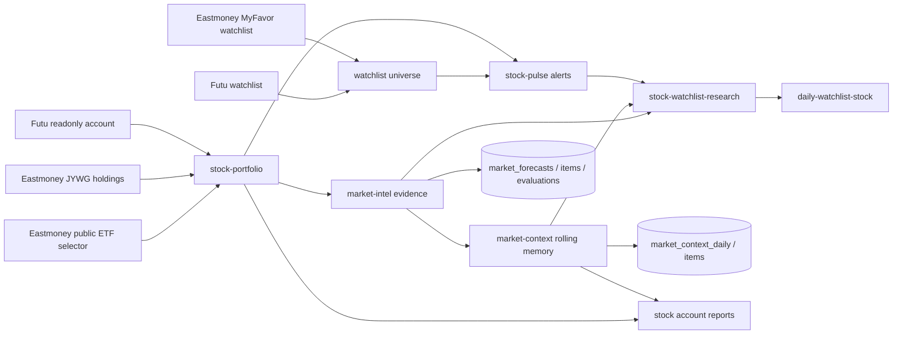

# 股票研究 Provider 流水线

> 结论：stock research docs 应作为一个 provider pipeline 阅读。`stock-portfolio` 创建 redacted account/asset view，`stock-pulse` 检测盘中异动，`market-intel` 增加 macro/evidence context 和 forecast persistence，`market-context` 保留跨日 rolling market memory，`stock-watchlist-research` 产出仅面向 watchlist 的 buy-timing research。

## 流水线



## 股票组合

Runtime name: `stock-portfolio`.

Owner code paths:

```text
src/providers/stock-portfolio/
  config.ts
  index.ts
  format.ts
  pie-chart.ts
  types.ts
```

Purpose:

- 在 LLM execution 前聚合多个 readonly broker providers。
- 保留每个 source 的 redacted structured payload。
- 在 prompt 前计算 CNY summaries、top gainers/losers、premium summaries，以及可选 private-channel asset summaries。
- 配置允许时可以在 optional source error 下继续，但所有 required sources 都失败时必须 fail closed。

Config example:

```yaml
continue_on_error: true
fail_if_all_sources_fail: true
market_scope: cn
base_currency: CNY
fx_rates:
  CNY: 1
  USD: 7.10
  HKD: 0.91
fx_rates_as_of: "YYYY-MM-DD"
fx_rates_source: manual-public-fx-snapshot
include_cny_summary: true
sources:
  - provider: eastmoney-jywg-readonly
    config: cn-stock
    label: Eastmoney CN
    required: false
  - provider: eastmoney-etf-premium
    config: cn-stock
    label: Eastmoney ETF premium
    include_asset_totals: false
    required: false
  - provider: futu-stock
    config: cn-stock
    label: Futu HK
    required: false
```

Contract:

- `cny_summary` 是 CNY P&L 的 reporting source；LLM report 不应重新计算 missing values。
- `asset_summary` 只用于 private-channel，可能包含 exact total assets、cash、market value、holdings amount 和 allocation categories。
- `include_asset_totals: false` 防止通过多个 market profiles 查询 integrated broker accounts 时重复计数。
- Eastmoney ETF premium rows 必须以 JYWG holding rows 为锚点。配置后，`eastmoney-etf-premium` 可以用相同六位代码从 Eastmoney public fund selector enrich 已持有 ETF。
- Public fund selector values 使用 `data_source=eastmoney_fund_selector`；`PREMIUM_DISCOUNT_RATIO` 保留为 `eastmoney_discount_ratio`，同时 `premium_rate = 0 - PREMIUM_DISCOUNT_RATIO`。
- Public ETF premium data 不能证明某个 symbol 被持有。如果没有 JYWG holding row，`stock-portfolio` 不得仅凭 public source 输出 position premium row。
- 如果没有 source 成功且 `fail_if_all_sources_fail=true`，不要调用 LLM。

## 股票脉冲

Runtime name: `stock-pulse`.

Owner code paths:

```text
src/providers/stock-pulse/
  analyzer.ts
  config.ts
  index.ts
  market.ts
  symbols.ts
  watchlist-sources.ts
  yahoo-client.ts
  fixtures/*.json
```

Purpose:

- 在 active market/user windows 扫描 portfolio 和 watchlist symbols。
- 在要求 LLM 解释 alerts 前，先使用 deterministic quote/bar analysis。
- 保持 account holdings 和 observation-universe symbols 分离。

Runtime flow:

```text
cron task
  -> pre_provider: stock-pulse
    -> active_window + market session guard
    -> stock-portfolio for held symbols
    -> manual watchlist and optional universe sources
    -> Yahoo chart 5m / 60d bars
    -> anomaly scoring
    -> alerts[] + position_groups[] + run_context
```

Anomaly signals:

- `hour_move`
- `day_move`
- `abnormal_frequency`
- `one_way_bars`
- `z_score`

Severity levels:

- `notice`: 一个轻量 trigger。
- `alert`: 两个或更多 triggers。
- `urgent`: urgent z-score、大 day move，或 abnormal 5m-bar count 超过 expected p95。

Universe sources:

- `futu_watchlist`: local Futu OpenD + official SDK watchlist groups。
- `eastmoney_myfavor_watchlist`: Eastmoney MyFavor readonly groups and securities。
- `yahoo_screener`: public predefined US screeners。
- `eastmoney_clist`: public CN/HK movers。

Universe rows 是 observation candidates。它们不能被描述为 account holdings。

## 市场情报

Runtime names:

- `market-intel`
- `market-forecast-evaluation`
- `market-calibration`

Owner code paths:

```text
src/providers/market-intel/**
src/providers/market-forecast-evaluation/**
src/store/market-forecasts.ts
```

Purpose:

- 在 LLM 写 pre-market reports 前采集 structured market evidence。
- 用 source IDs、source tiers、capture times 和 freshness 让 evidence 可审计。
- 持久化 forecast JSON，并只评估适合的 forecast horizons。
- 保持 market research 与 trading execution 分离。

Evidence source policy:

- Default/primary: SEC、BLS、Treasury、Federal Reserve、Cboe history、PBOC、NBS、SSE、SZSE、HKEX，以及有权限时的 Futu OpenD。
- Optional: 本地 credentials 存在时使用 FRED API、Polygon、Tushare。
- Fallback-only: Yahoo chart 和 Eastmoney public endpoints，并下调 `data_quality`。
- Excluded from default: Stooq 和 AKShare。

Forecast persistence:

- `market_forecasts`: provider payload、final report text 和 run context。
- `market_forecast_items`: same-day probabilities、horizon probabilities、sector opportunities 和 risk alerts。
- `market_forecast_evaluations`: post-market benchmark outcomes、hit/miss、Brier score 和 calibration notes。

Horizon contract:

- `horizon_probabilities`、`horizon_sector_opportunities` 和 `horizon_risk_alerts` 是 medium/long horizon items（`1m`、`3m`、`6m`、`1y`）。
- Same-day hit/miss 和 Brier score 需要显式 same-day `index_probability`。
- Horizon-only forecasts 应报告 `status=horizon_only` 并跳过 same-day evaluation。

## 市场上下文

Runtime name: `market-context`.

Owner code paths:

```text
src/providers/market-context/
  config.ts
  index.ts
  types.ts
src/store/market-context.ts
```

Purpose:

- 为 `us`、`cn-a`、`hk` 和 `cross-market` scopes 维护每日 rolling market memory。
- 把 active macro/news/regime context 注入股票 cron task，但不替代 primary provider payload。
- 把 LLM 维护的 summary 和稳定长期事项持久化到 SQLite，让明天的更新能从昨天的记忆开始。
- 保持 broad-market memory 与账户持仓、quotes 和 trading actions 分离。

Runtime modes:

- `mode: update`: 用于每日 market-context cron jobs。provider 会加载最近 daily digests、active items 和可选的最新 `market_forecasts` data；下游 LLM 必须以有效 `<market_context_json>` block 结尾。`runner-task` 会把这个 block 持久化到 `market_context_daily` 并 upsert `market_context_items`。
- `mode: inject`: 通过 `pre_context_providers` 用于普通股票 cron jobs。它会按配置 scopes 加载最新 daily digests 和 active items，并在 task 的主 `pre_provider` 前注入。

Config examples:

```yaml
# ~/.miniclaw/providers/market-context/us-update.yaml
mode: update
market_scope: us
timezone: America/New_York
forecast_market_scope: us
forecast_session: pre_market
max_items: 24
max_digest_chars: 3000
```

```yaml
# ~/.miniclaw/providers/market-context/cn-hk-inject.yaml
mode: inject
market_scopes:
  - cn-a
  - hk
  - cross-market
timezone: Asia/Shanghai
max_items: 20
max_digest_chars: 2500
```

Cron injection example:

```yaml
pre_context_providers:
  - provider: market-context
    config: cn-hk-inject
pre_provider: market-intel
pre_provider_config: cn-pre-market
```

Persistence contract:

- `market_context_daily` 按 `(market_scope, trade_date)` 存储一份 digest，并在可用时链接到上一份 daily context。
- `market_context_items` 按 `(market_scope, stable_key)` 存储稳定的 active/stale/resolved items。
- `resolved_items` 默认写成 `status=resolved`；active injection 只返回未过期的 `status=active` items。
- `market-context` 不是 quote source。它和更新鲜的 provider evidence 冲突时，下游 report 必须优先使用更新鲜的 provider，并说明冲突。

## 自选股研究

Runtime name: `stock-watchlist-research`.

Owner code paths:

```text
src/providers/stock-watchlist-research/
  config.ts
  index.ts
  research-client.ts
  types.ts
```

Purpose:

- 研究 broker watchlist 中尚未持有的 symbols。
- 使用 `stock-pulse.universe.sources` 中启用的 Futu / Eastmoney MyFavor watchlist sources。
- 用 linked `stock-portfolio` config 排除已持有 symbols，但不向下游暴露被排除的 holding symbols。
- 增加 quote、profile、fundamentals、news，以及可选的 portfolio-free `market-intel` context。

Output contract:

- 必须存在 `run_context.watchlist_only=true`。
- `watchlist_source.portfolio_filter` 可以报告 counts 和 config names，但不能报告 excluded holding codes。
- `symbols[]` 包含 watchlist-only symbols 的 quote/profile/financials/news evidence。
- `market_context` 必须移除 `portfolio_provider_config`；watchlist research 不应输出 account assets、costs、P&L 或 holding quantities。
- Buy-timing labels 限定为：`worth_small_starter`、`wait_for_pullback`、`not_buyable_now` 和 `watch_only`。

Cron example:

```yaml
channel: "<daily-watchlist-stock channel id>"
pre_provider: stock-watchlist-research
pre_provider_config: us-pre-market
pre_provider_preflight: health
```

## 报告边界

- 当目标是可信 private stock channels 时，portfolio/account reports 可以提及 held positions 和 P&L。
- Watchlist research 不能暗示 watchlist symbols 是 holdings。
- Market-intel probabilities 是 research inputs，不是 trading instructions。
- 本 pipeline 中没有任何 provider 可以解锁交易、下单、改单或转移资金。

## 历史遗留清理

上一轮 stock research feature-level stubs 已在迁移完成后删除。新的实现事实应写到本文件，或写到 [`eastmoney.zh.md`](eastmoney.zh.md) 等 stock source family docs。

Verification owner:

```bash
pnpm vitest run src/providers/stock-portfolio src/providers/stock-pulse src/providers/market-intel src/providers/market-forecast-evaluation src/providers/stock-watchlist-research
pnpm run quality:docs
pnpm run typecheck
pnpm run lint
pnpm cron:list
```
