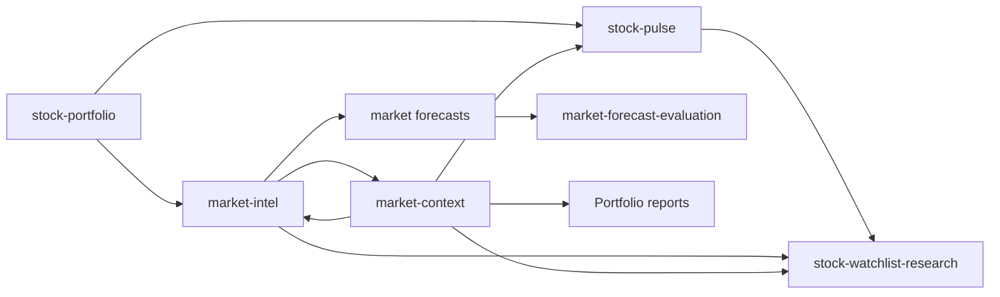

# Stock Workflows

> 结论：stock workflows 是 data products 加 cron composition。Data products 位于 `src/stock/reports/*`；cron YAML 决定运行时间、注入哪个 market context，以及最终报告送到哪个 Discord stock channel。

## Product Pipeline



## Data Products

`stock-portfolio`:

- Inputs: Futu account snapshots、Eastmoney JYWG account evidence、可选 Eastmoney ETF premium enrichment。
- Output: redacted portfolio JSON，包含 source status、CNY summary、可选 asset summary、premium summary、warnings 和可选 pie chart attachment。
- State: 只有 downstream task 成功后才 commit source provider state。
- Failure policy: optional source failures 可以保留为 warnings；required source failures 或 all-source failure 可以阻止 LLM task。
- Code paths: `src/stock/reports/stock-portfolio.ts`、`src/stock/data/portfolio*.ts`、`src/stock/reports/portfolio-pie-chart.ts`。

`stock-pulse`:

- Inputs: portfolio symbols、manual watchlists、可选 broker watchlist sources、Yahoo chart bars。
- Output: alerts、position groups、quote failures、universe source summaries 和 run context。
- State: 使用 nested portfolio providers 的 delayed commits。
- Failure policy: closed-market windows 会 deterministic skip；source degradation 会被报告且不暴露 secrets。
- Code paths: `src/stock/reports/stock-pulse.ts`、`src/stock/data/pulse-types.ts`、`src/stock/data/universe.ts`、`src/stock/signals/pulse.ts`。

`market-intel`:

- Inputs: calendar state、benchmark quotes、可选 portfolio context、official market evidence、scoring calibration。
- Output: market snapshot、evidence sections、index direction score、sector opportunities、risk level、data quality notes 和 forecast prompt context。
- State: portfolio source commits 延迟到 downstream success。
- Failure policy: closed markets 可以 skip；fallback quotes 会降低 data quality。
- Code paths: `src/stock/reports/market-intel.ts`、`src/stock/reports/market-intel-format.ts`、`src/stock/data/market-*.ts`、`src/stock/signals/market-intel*.ts`。

`market-context`:

- Inputs: recent market context rows、active/stale/resolved items、可选 latest forecast data。
- Output: injected market memory 或 update-mode prompt context。
- State: update-mode persistence 发生在 downstream LLM 输出有效 `<market_context_json>` block 之后。
- Failure policy: health 和 dry-run 由 framework 支持；stale memory 应在输出中明确。
- Code paths: `src/stock/reports/market-context.ts`、`src/stock/data/market-context-types.ts`、`src/stock/data/market-memory.ts`、`src/store/market-context.ts`。

`market-forecast-evaluation`:

- Inputs: stored pre-market forecasts、benchmark quote outcomes、可选 portfolio context。
- Output: benchmark outcomes、hit/miss、probability groups、Brier score、calibration notes 和 stored evaluation rows。
- State: 写入 evaluation records 到 `market_forecast_evaluations`。
- Failure policy: horizon-only forecasts 跳过 same-day scoring；unavailable quotes 产生 `unknown` outcomes。
- Code paths: `src/stock/reports/forecast-evaluation.ts`、`src/stock/signals/forecast-evaluation*.ts`、`src/store/market-forecasts.ts`。

`stock-watchlist-research`:

- Inputs: stock-pulse config 中的 broker watchlist sources、portfolio exclusion filter、Yahoo research data、可选 portfolio-free market-intel context。
- Output: watchlist-only symbol research，包含 quote、profile、fundamentals、news、market context 和 buy-timing labels。
- State: 不 commit account state。
- Failure policy: 排除 held symbols 时不暴露 excluded holding codes；配置 preflight 时 unavailable broker watchlists fail closed。
- Code paths: `src/stock/reports/watchlist-research.ts`、`src/stock/reports/watchlist-research-types.ts`、`src/stock/sources/yahoo/watchlist-research-client.ts`。

## Cron Workflow Groups

Pre-market:

- `us-stock-pre-market`: 注入 `market-context/us-inject`，再运行 `market-intel/us-pre-market`。
- `cn-stock-pre-market`: 注入 `market-context/cn-hk-inject`，再运行 `market-intel/cn-pre-market`。
- Purpose: 交易日前准备 market evidence 和 forecast prompt context。

Intraday pulse:

- `us-stock-hourly-pulse`: 注入 `market-context/us-inject`，再运行 `stock-pulse/us-hourly`。
- `cn-stock-hourly-pulse`: 注入 `market-context/cn-hk-inject`，再运行 `stock-pulse/cn-hourly`。
- Purpose: 在 active windows 中检测 holdings 和 observation universes 的 movement。

Portfolio reports:

- `daily-stock-summary`: 注入 `market-context/global-stock-inject`，再运行 `stock-portfolio/daily-stock-summary`。
- `cn-stock-ing-market`: 注入 `market-context/cn-hk-inject`，再运行 `stock-portfolio/cn-stock`。
- Purpose: 给 trusted stock channels 汇总 account 和 asset state。

Post-market forecast evaluation:

- `us-stock-post-market`: 注入 `market-context/us-inject`，再运行 `market-forecast-evaluation/us-post-market`。
- `cn-stock-post-market`: 注入 `market-context/cn-hk-inject`，再运行 `market-forecast-evaluation/cn-post-market`。
- Purpose: 比较 stored forecasts 与 benchmark outcomes，并反馈 calibration。

Market memory updates:

- `us-market-context-daily`: 运行 `market-context/us-update`。
- `cn-a-market-context-daily`: 运行 `market-context/cn-a-update`。
- `hk-market-context-daily`: 运行 `market-context/hk-update`。
- `cross-market-context-daily`: 运行 `market-context/cross-market-update`。
- Purpose: 持久化 rolling daily memory，供后续 `pre_context_providers` 注入。

Watchlist research:

- `us-watchlist-stock-pre-market` 和 `us-watchlist-stock-daily`: 注入 `market-context/us-inject`，再运行 `stock-watchlist-research` config。
- `cn-watchlist-stock-pre-market` 和 `cn-watchlist-stock-daily`: 注入 `market-context/cn-hk-inject`，再运行 `stock-watchlist-research` config。
- Purpose: 研究 non-held broker-watchlist symbols，且不向下游暴露 account holdings。

## Cron Composition Rules

- `pre_context_providers` 提供 background context，不应该替代 main product payload。
- 对 session-backed fragile products，task creation 前应使用 `pre_provider_preflight: health`。
- Product output 在最终 LLM report 前应保持 structured JSON。
- Reports 可以解释事实，但不能重新计算缺失账户值，也不能把 watchlist rows 转成 holdings。
- 有 side effects 的 provider 只能在 downstream task success 后 commit runtime state。

## Local Config Roots

```text
~/.miniclaw/cron/*.yaml
~/.miniclaw/providers/stock-portfolio/*.yaml
~/.miniclaw/providers/stock-pulse/*.yaml
~/.miniclaw/providers/market-intel/*.yaml
~/.miniclaw/providers/market-context/*.yaml
~/.miniclaw/providers/market-forecast-evaluation/*.yaml
~/.miniclaw/providers/stock-watchlist-research/*.yaml
```

repo docs 描述稳定语义。Account-specific paths、channel IDs 和 private runtime values 保留在 local config 或 `docs/private/**`。
