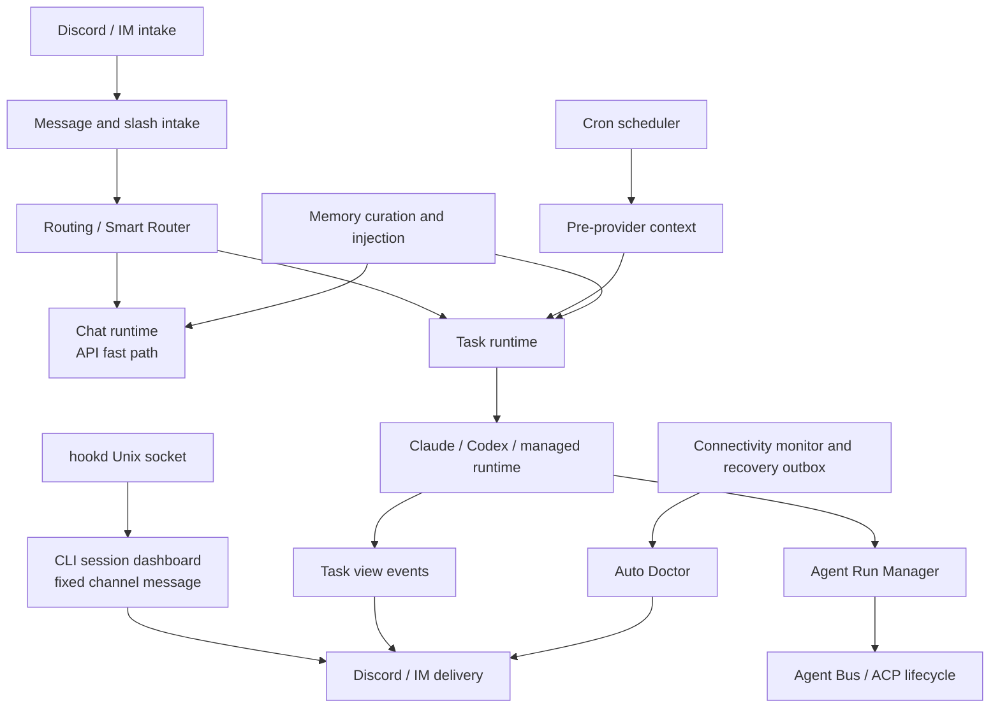
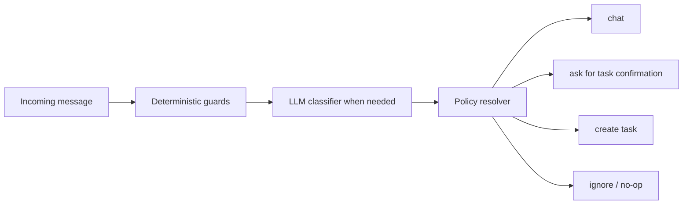
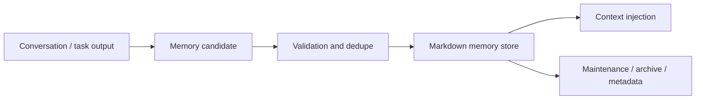

# MiniClaw Runtime 文档

> 结论：runtime 文档说明 MiniClaw 如何接收 Discord / IM 输入、路由 chat/task 工作、执行 cron 和 agent task、管理 memory/context，以及处理运行态恢复。Provider 文档负责外部数据采集 contract；runtime 文档负责执行、持久化、投递和修复行为。

## Runtime 地图



## 入口与路由

Owner docs:

- [`../../bot-routing.md`](../../bot-routing.md): Discord Gateway、message handling、slash command dispatch、thread continuation、channel routing，以及 chat/task 边界。
- [`../../chat-router-current-logic.md`](../../chat-router-current-logic.md): 当前代码级 chat router 逻辑和已知误分流边界。

Owner code paths:

```text
src/bot.ts
src/commands/**
src/discord/**
src/im/adapters/weixin/**
src/routing/**
src/agent/chat.ts
src/store/repositories/smart-router-decisions.ts
```

Routing contract:

- Slash command 先于自然语言 message routing。
- Thread continuation 必须保留原始 task/chat context，不能对每条 reply 从头重新分类。
- Smart Router 可以把像 task 的 prompt 转入 task path，但不能提升普通 chat 权限。
- Confirmation button 保存 pending task context，并且必须安全过期。
- Per-channel cwd override 是 routing context，不是 prompt 文本。
- Weixin chat 复用 `chat()` 边界，但会要求它优先使用 lightweight Anthropic/OpenAI-compatible API client，再 fallback 到配置的 agent runtime。
- Weixin direct 可以作为唯一启用的 IM gateway；当 `im.transports.discord.enabled=false` 时，Discord credentials 变为可选，MiniClaw 仍会启动非 Discord gateway。
- Weixin 入站媒体会在路由前标准化：官方 `image_item.media` 和 `voice_item.media` CDN 引用会被下载、按 AES-ECB 解密，语音 SILK 会尽量转成 WAV 后再进入附件处理链路。
- `hookd` 会在配置的 CLI sessions channel 里维护自动刷新的固定 dashboard message。`/sessions` 保留为手动 ephemeral 查询入口，并且和 `/status` 分离：`/status` 展示 MiniClaw-owned tasks，CLI session dashboard 展示通过 provider hooks 观测到的普通 Claude Code 或 Codex CLI sessions。

Smart Router resolution order:



## 任务输出与 Trace UX

Owner code paths:

```text
src/agent/task.ts
src/agent/task-reporter.ts
src/agent/task-view-events.ts
src/discord/task-view-reporter.ts
src/discord/task-trace-attachment.ts
scripts/task-trace.ts
```

Runtime contract:

- Task runner 负责执行和状态；Discord view code 负责渲染。
- Progress message 应保留到足以调试 task，而不是成功后立即删除。
- Final task result 应尽量作为普通 Markdown message 发送，而不是藏在窄 embed description 里。
- Task events 是 runner、trace 和 Discord rendering 之间的共享边界。
- 大 trace 应导出或作为附件发送，而不是刷屏到 Discord message。

Current delivery shape:

- Status card: 简短 embed，展示当前状态。
- Progress stream: 持久 progress/update message。
- Final result: 普通 Markdown message，必要时 chunking。Discord 正文 chunk 会 suppress link embeds，裸 URL 只会在最后的 link-preview footer 里重复，因此卡片出现在完整结果之后，而不是插在正文 chunk 中间。
- Fanout and replay: Discord IM fanout、recovery outbox replay 和 script cron `DISCORD_MESSAGE` output 使用与 task results 相同的 deferred-link-preview helper。
- Weixin delivery: 文本使用 `sendmessage`；文件投递使用官方 `getuploadurl -> CDN AES upload -> sendmessage` 链路，并把 caption 和媒体拆成独立 message item。Session expired `-14` 会让受影响账号暂停一小时。
- Weixin chat 会在 `getconfig` 返回 typing ticket 时发送 `sendtyping` start、keepalive 和 cancel 信号，让较长 LLM 回复在微信里有可见的输入状态。
- Trace view: task events 和 trace-export command 提供 operator 级细节。

## 外部 CLI Session 控制

Owner code paths:

```text
src/hookd/**
src/store/cli-sessions.ts
src/store/task-control-events.ts
src/discord/cli-session-dashboard.ts
src/discord/cli-session-dashboard-updater.ts
src/bot/cli-session-buttons.ts
src/bot/cli-session-modals.ts
scripts/hookd-install.ts
```

Runtime contract:

- `hookd` 通过 `hookd.enabled` opt-in；MiniClaw 正常启动时不会自动编辑 `~/.claude/settings.json` 或 `~/.codex/hooks.json`。
- Managed hook installation 是显式操作，默认 dry-run：`pnpm hookd:install` 预览变更，`pnpm hookd:install -- --execute` 写入 MiniClaw-managed entries，`pnpm hookd:doctor` 报告 managed hook count、socket path 状态和 Codex hook feature flag。
- Hook entries 调用构建后的 `dist/hookd/hook-client.js` bridge，并带有 `MINICLAW_HOOKD_MANAGED=1` marker。installer 只移除并替换带这个 marker 的 entries，然后在 `~/.miniclaw/hooks/manifest.json` 写 manifest。
- Claude hooks 覆盖 session、prompt、tool、notification、compaction、stop 和 blocking `PermissionRequest` events。Codex hooks 只在 `[features] codex_hooks = true` 已启用时安装，除非 operator 传入 `--enable-codex-feature`。
- Provider hooks 把 newline-delimited JSON 发送到 `hookd.sock`；MiniClaw 会 normalize provider、session id、cwd、pid、tty、terminal hints、transcript path、event name 和 phase。
- CLI session state 存在 `cli_sessions` 和 `cli_session_events`，不会进入 `tasks`。Dashboard `Continue` 会把 follow-up text 发送到原始 iTerm2 live process，不会创建 MiniClaw task row。
- Blocking Claude `PermissionRequest` events 会创建 redacted `cli_session_approvals` rows，并保持 hook response open，直到 Discord approve、Discord deny、timeout 或 daemon startup expiry。timeout 和 startup expiry 默认 deny。
- 自动控制面是一条可编辑的 Discord message，目标来自 `hookd.dashboard_channel_id` 或 `hookd.dashboard_channel_name`（默认 `miniclaw-cli-sessions`）。配置 `hookd.dashboard_message_id` 时 MiniClaw 会编辑该消息；未配置或消息不存在时，会创建并 best-effort pin 新 dashboard message，同时在日志提示把 message id 写回配置。
- Hook events、approval lifecycle changes、dead-PID zombie scan、Hide、Approve、Deny，以及成功的 live Continue 操作都会按 `hookd.dashboard_update_debounce_ms` debounce 后刷新固定 dashboard。
- Dashboard 排序按状态优先：approval、active、stale active、idle，然后才是 history/hidden。较早打开但仍 active 的工作会排在较新的 idle sessions 上方。
- 空 Codex startup sessions 默认不显示，直到出现真实 prompt 或 transcript activity。
- 自动固定 dashboard 只显示当前需要关注的 approval、active、stale active 和 idle sessions。closed 或 hidden history 仍通过 `/sessions status:closed` 和 `/sessions status:hidden` 查询。
- Discord buttons 支持 `Details`、`Hide`、`Approve` 和 `Deny`。`Continue` 只对 idle 且由 iTerm2 承载的 sessions 可用，并打开 Discord modal 填写 follow-up instruction。
- Live terminal Continue 优先使用 `terminal_surface_json.iterm_session_id` 中记录的 iTerm2 session id；如果缺失，则 fallback 到唯一匹配的 recorded tty。目标缺失、歧义、进程死亡或 tty 不匹配时 fail closed，不会 fallback 到 provider-native resume。
- Active external CLI sessions 不接收 input injection。只有被观测 session 处于 idle 且 iTerm2 target 能精确解析时，MiniClaw 才会写入原始 iTerm2 live process。
- Running MiniClaw-owned task threads 现在会把 operator replies 持久化为 queued `task_control_events`，而不是启动第二个 resume task。当前 runners 还不会消费这个 queue；它是下一个 interactive runtime slice 的 durable control-plane contract。

## Weixin 协议兼容

MiniClaw 的 Weixin adapter 是 native IM transport 实现，当前对齐官方源码快照 `tencent-weixin-openclaw-weixin 2.4.3` 和 npm 包 `@tencent-weixin/openclaw-weixin` 版本 `2.4.3`。它运行时不直接 import 这个官方包；本地 adapter 负责 MiniClaw routing、credential storage、Smart Router confirmation、task reporting 和 delivery semantics。

跟踪的官方协议文件：

```text
src/api/types.ts
src/media/media-download.ts
src/messaging/send-media.ts
src/cdn/upload.ts
src/api/session-guard.ts
src/auth/login-qr.ts
```

官方包升级时的流程：

1. 把官方包源码放到本地，然后运行 `pnpm weixin:drift-check -- --package-dir /path/to/tencent-weixin-openclaw-weixin`。
2. 只有 drift report 显示官方协议 anchor 改变时，才更新 MiniClaw；改完后运行 `pnpm test src/im/__tests__/weixin-transport.test.ts`。
3. 保持 `src/im/__fixtures__/weixin-official-payloads.json` fixture coverage 最新；它覆盖官方形状的 image media、voice media、media upload、QR expiration、session-expired `-14` 和 chat/task confirmation payloads。
4. Unit tests 通过后跑 live smoke：`pnpm weixin:login`，停止正常 gateway，然后运行 `pnpm weixin:smoke -- --account <accountId> --target <user@im.wechat> --image /path/to/image --save-buffer`。
5. 重启 MiniClaw 并手动验证 end-to-end routing：普通文字应该作为 chat 回复，像 task 的消息应该询问 `y` or `n`，回复 `y` 应执行 task，回复 `n` 应继续 chat。

## Cron Runtime 执行时

Owner code paths:

```text
src/cron/**
src/providers/index.ts
src/providers/framework.ts
src/store/cron-runs.ts
```

Execution flow:

```text
cron schedule
  -> load job config
  -> enabled 时应用全局 config.yaml cron.active_window guard
  -> optional provider health/dry-run preflight
  -> run pre_provider when configured
  -> inject provider text into task prompt
  -> inject task output contract when configured
  -> execute task runtime
  -> run output validator hook
  -> commit provider state only after downstream task success
  -> persist cron run and recovery metadata
```

Runtime contract:

- Provider commit callback 只能在 downstream task 成功后运行。
- Provider failure 默认 fail closed，除非 provider config 明确允许 partial data。
- Cron loader 会忽略 `_profiles/` 和 `_fragments/`，不把它们当作可运行 job；随后把 `workflow.profile`、`workflow.main_provider`、`workflow.context_providers`、`workflow.preflight` 和 `rules.use` 展开成普通 job shape，再进入校验。
- Cron `script` 和 task `pre_script` 子进程会继承 MiniClaw runtime metadata 以及规范化后的 PATH。`MINICLAW_CRON_PATH_PREPEND` 和 `MINICLAW_CRON_PYTHON_BIN` 优先级最高；存在 active `CONDA_PREFIX` 时，会把 `CONDA_PREFIX/bin` 放到继承 PATH 前面，让 `#!/usr/bin/env python3` helper 使用预期的本地 Python 环境。
- `type=task` job 可以在 cron YAML 内配置 inline `output_template` 或 `output_contract.template` 文本，在 provider/script context 之后、job prompt 之前注入 prompt-level output contract。
- 配置 output contract 时，MiniClaw 会先注入共享 chat/IM output surface policy；cron YAML 只应描述报告结构、机器块、privacy/link/length 例外和其他 job-specific 格式。
- Output contract 是给 LLM 的格式指令，不是 deterministic renderer；v1 不会在 task 执行后重写最终消息。
- `output_contract.validator` 预留 runtime validation。v1 只支持 `none`，但 hook 会在 task result 成功后、extra delivery、attachment delivery 和 provider commit callback 之前运行。
- `cron.active_window` 是全局 scheduled-dispatch guard。窗口外 MiniClaw 写入 `error_category=outside_active_window` 的 skipped `cron_runs` row，不调用 script、provider 或 task runtime。
- Missed-run audit 会忽略 `cron.active_window` 之外的 expected schedules，避免睡眠/离线时段产生误报 missed-run incident。
- 手动 `pnpm cron:test` 会绕过 `cron.active_window`，因为它是显式 operator action。
- Cron run record 是 Auto Doctor 和 recovery workflow 的运维证据。
- Script job 和 task job 共享 delivery semantics，但不共享 prompt/provider handling。

## Agent Runtime 执行时

Owner code paths:

```text
src/agent/**
src/runtime/agent-runtime.ts
src/config/domains/agent.ts
```

Runtime contract:

- Claude 和 Codex 是 shared task runner boundary 后面的 runtime implementation；routing 负责决定什么时候把任务交给 agent runtime。
- Codex task 使用 Codex TypeScript SDK，但 MiniClaw 可以通过 `codex.path` 或 `MINICLAW_CODEX_PATH` 提供 CLI binary override。未设置时，runtime 会先偏向 `/opt/homebrew/bin/codex` 这类系统 Codex CLI，再 fallback 到 SDK package auto-discovery。
- Codex model、reasoning、sandbox、approval、web search、network access 和 CLI path 都是 MiniClaw runtime setting。model 或 policy 字段设为 `inherit` 时，对应字段交给 Codex CLI 从本地 `~/.codex/config.toml` 读取。

## Memory 与 Prompt 上下文

Owner code paths:

```text
src/memory/**
src/agent/prompts.ts
src/routing/*context*.ts
src/cron/runner-task.ts
```

Prompt/context contract:

- Chat、task、cron、provider、memory 和 runtime adapter context 必须作为显式 component 组装。
- 不可信 user/provider content 应与 system/developer instruction 隔离。
- Provider payload 进入 prompt 前应 schema-aware 且经过 compact。
- Memory injection 应有用但有界；route 不需要时，task prompt 不应收到无关的 always-on memory。
- 完整 cron prompt 和 provider payload 都是高敏数据，不应过度持久化。

Memory lifecycle:



## 连接性与恢复

Owner code paths:

```text
src/monitoring/connectivity-core.ts
src/monitoring/connectivity-monitor.ts
src/monitoring/recovery-outbox.ts
src/monitoring/pre-client-ready-watchdog.ts
src/runtime/discord-login.ts
src/notifications/smtp-email.ts
```

Operations contract:

- Connectivity check 会分别分类 Discord、network、SMTP fallback 和 startup readiness。
- Discord/VPN/proxy outage alert 在 general network 和已配置邮件服务仍可达时通过 SMTP email 发送。
- Discord startup login failure 会在 `notifications.email` 启用时发送 email ops alert，然后按 10 分钟、20 分钟、40 分钟 backoff 重试；重试预算耗尽后才 fallback 到非 Discord IM gateway。
- Recovery outbox 应在 Discord connectivity 恢复后回填失败的 cron/task delivery。
- Pre-clientReady watchdog failure 应在本机可见，并且输出经过 redaction。

## Auto Doctor 诊断器

Owner code paths:

```text
src/ops/doctor.ts
src/ops/doctor/**
src/ops/doctor-scheduler/**
src/ops/doctor-repair/**
src/ops/doctor-ship.ts
scripts/doctor.ts
scripts/doctor-repair.ts
scripts/doctor-ship.ts
```

Doctor capabilities:

- Diagnose task、cron、PM2、logs、connectivity、third-party health 和 recent incidents。
- 持久化 incident category、status、evidence、summary 和 trace references。
- 在发送 Discord summary 前聚合重复失败。
- 在隔离 worktree 中按 path policy 和 verification 运行 guarded repair。
- 只能通过显式 guarded command preview 和 ship repair branch。

Safety boundary:

- Auto Doctor evidence collection 默认只读。
- Repair execution 必须 path-scoped、verified，并与无关 user changes 隔离。
- Ship flow 不能绕过 review、verification 或 restart policy。
- Secrets、cookies、tokens、account IDs 和 raw private provider payloads 必须从 report 中 redacted。

## Agent Run Manager 管理器

Owner code paths:

```text
src/agent/run-manager/**
src/agent/run-manager/acp/**
src/agent/run-manager/mcp/**
src/agent/runtimes/task-runner-runtime.ts
```

Runtime boundary:

- Agent Run Manager 是 task-scoped orchestration，不是默认 chat path。
- 它负责 managed child runtime scheduling、Agent Bus state、final synthesis、ACP lifecycle 和 managed runtime routing。
- 可选的 `agent_run_manager.model_routing` 可以按 child role 选择 provider/model/reasoning，让 planner 使用更强模型，同时让 generator/evaluator 使用更便宜模型。Escalation 可在 runtime failure 或 evaluator 返回 `FAIL` 后，用更强模型重试后续 generator turn。
- Child runtime 通过受控 adapter 接收 injected task context，不能任意访问 live MiniClaw state。
- Final synthesis 应引用 child outcomes，并保留 failed/partial child state。
- Sweeper 和 guardrails 必须防止 stuck run 和无界 child-runtime 增长。

## 历史遗留清理

上一轮 feature-level runtime stubs 已在迁移完成后删除。本文件现在是这些 runtime 主题的 canonical 中文 mirror。

## 开发检查清单

- Routing 或 Smart Router 行为变化：更新本文件、[`../../bot-routing.md`](../../bot-routing.md) 和 [`../../chat-router-current-logic.md`](../../chat-router-current-logic.md)。
- Task output、task events 或 trace 行为变化：更新 Task Output section。
- Cron execution 或 provider commit semantics 变化：更新 Cron Runtime section 和相关 provider docs。
- Prompt assembly、provider payload compaction 或 memory injection 变化：更新 Memory And Prompt Context section。
- Connectivity、recovery、watchdog 或 SMTP fallback 变化：更新 Connectivity And Recovery section。
- Auto Doctor diagnose/repair/ship 行为变化：更新 Auto Doctor section。
- Agent Run Manager scheduling、bus、ACP lifecycle、child runtime injection 或 final synthesis 变化：更新 Agent Run Manager section。

Verification owner:

```bash
pnpm run quality:docs
pnpm run typecheck
pnpm run lint
pnpm test
pnpm run e2e:cron
```
