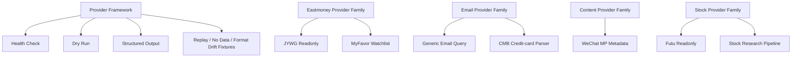

# Providers

Providers prepare trusted context for cron jobs, tasks, and research workflows. The migration plan keeps provider implementation contracts in repo docs and exposes only curated summaries here.

