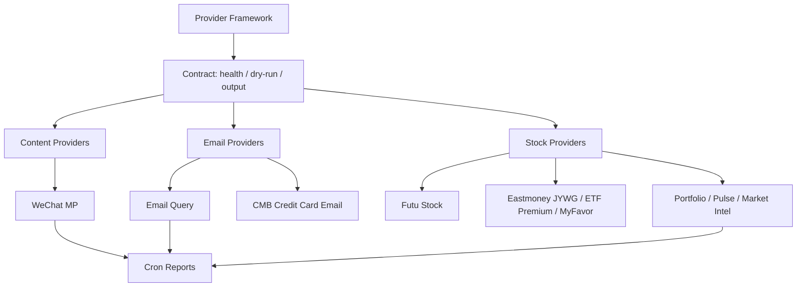
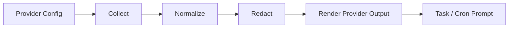

# Providers

Providers are read-only context collectors. They run before an agent prompt, turn external data into structured text, and keep account-specific state outside the public repository.

## Provider Principles

- **Readonly first**: provider docs and code should make mutation boundaries explicit.
- **Structured before summarized**: providers gather facts; the LLM interprets and writes the report.
- **Session isolation**: cookies, app passwords, brokerage sessions, and account state stay in `~/.miniclaw/`.
- **Replayable failures**: no-data, auth-expired, and format-drift cases need fixture or dry-run coverage.
- **Family docs over legacy stubs**: provider contracts now live in `docs/providers/`; the old feature stubs have been merged and removed.

## Context Shape

The website exposes the provider map. Implementation contracts, provider-specific setup, and drift-prone details remain in the linked source docs.

Stock portfolio reports can combine held-position evidence from Eastmoney JYWG with public ETF premium evidence from Eastmoney's fund selector. The public premium source is code-matched enrichment only; it is never treated as proof of account holdings.
