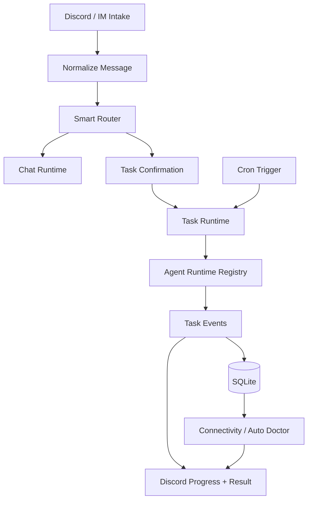
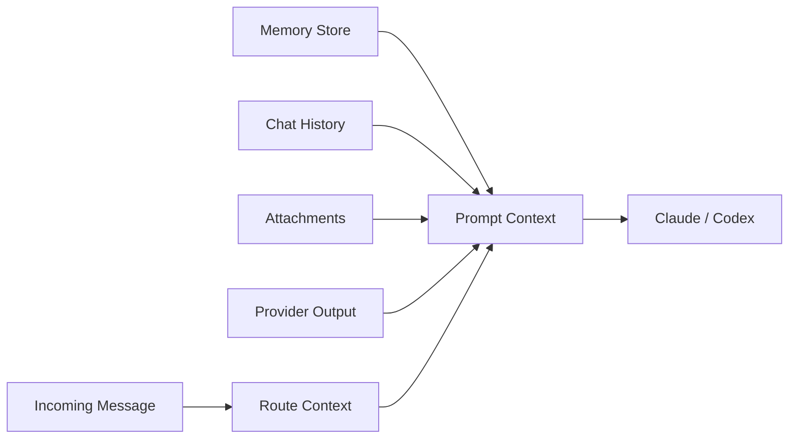

# Runtime

The runtime turns an intake event into a bounded chat response, a managed task thread, or a scheduled provider-driven report. The same event model feeds trace storage and recovery.

## Runtime Responsibilities

- **Intake normalization**: Discord events become a consistent route input.
- **Routing semantics**: Smart Router separates chat, suggested task, confirmed task, and trusted auto-task channels.
- **Task lifecycle**: task threads, progress cards, tool traces, final Markdown output, cancellation, and resume behavior are runtime concerns.
- **Cron execution**: cron jobs can collect provider output before creating the agent prompt.
- **Recovery loop**: connectivity and doctor repair paths reuse stored incidents and trace evidence.

## Context Assembly

Runtime docs carry the implementation details and path ownership. This website page keeps the mental model stable for readers who need to understand how work moves through the system.
