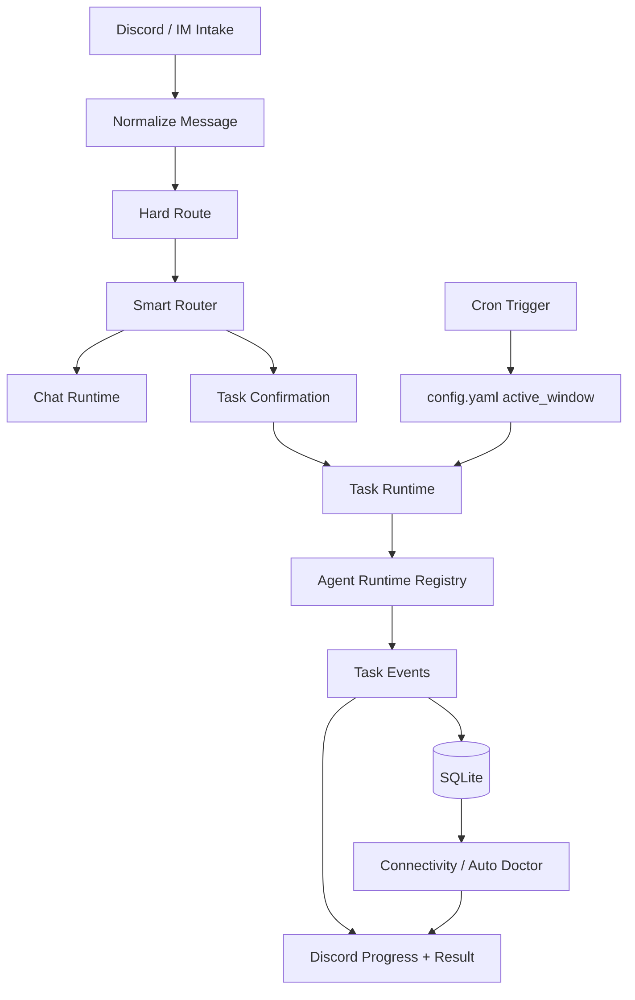
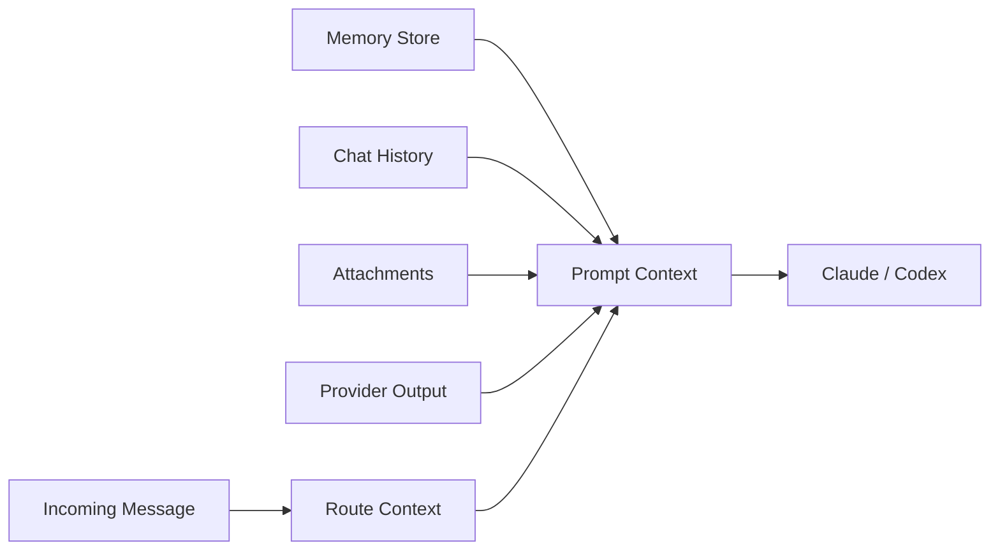

# Runtime

The runtime turns an intake event into a bounded chat response, a managed task thread, or a scheduled provider-driven report. A hard Discord route runs first; Smart Router only acts inside the chat-eligible path.

## Runtime Responsibilities

- **Intake normalization**: Discord events become a consistent route input before any agent runtime is called.
- **Routing semantics**: the hard route decides ignore/thread continuation/task channel/chat; Smart Router separates chat, suggested task, confirmed task, and trusted auto-task channels.
- **Task lifecycle**: task threads, progress cards, tool traces, final Markdown output, cancellation, and resume behavior are runtime concerns.
- **Discord delivery**: long Markdown results are chunked into Discord-sized messages so link-heavy cron reports stay readable.
- **Cron execution**: scheduled cron dispatches pass through the global `config.yaml` active-window guard before scripts, providers, or task runtime run.
- **Recovery loop**: connectivity and doctor repair paths reuse stored incidents and trace evidence.
- **Merged runtime docs**: feature-level runtime notes have been folded into the runtime source docs.

## Context Assembly

Runtime docs carry the implementation details and path ownership, including button dispatch, slash command dispatch, and thread continuation. This website page keeps the mental model stable for readers who need to understand how work moves through the system.
