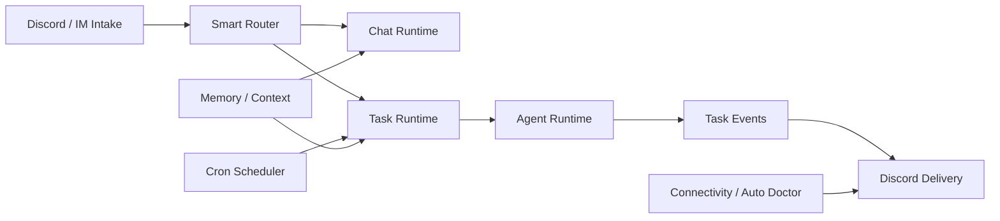

# Runtime

MiniClaw runtime connects Discord intake, Smart Router decisions, cron tasks, managed agent execution, memory/context, and recovery operations.

The website keeps this as a readable map. Implementation rules, owner paths, and drift-sensitive contracts live in the repo runtime docs and their current Chinese mirror.
