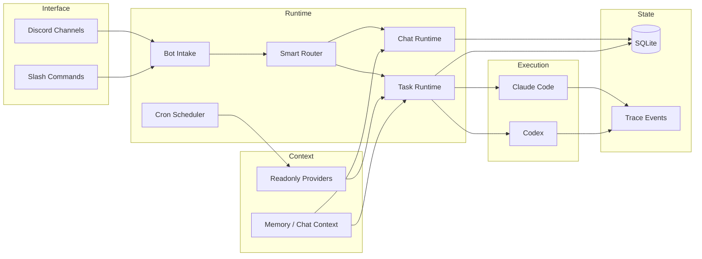
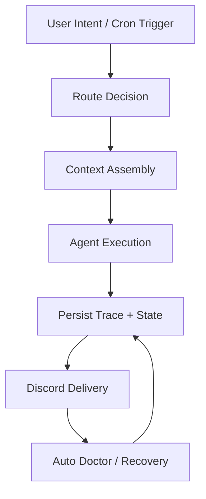

# Architecture

MiniClaw is shaped around one boundary: Discord is the control and delivery surface, while the local runtime owns routing, provider context, task execution, storage, recovery, and quality traceability.

## Boundary Map

- **Interface boundary**: Discord carries user intent, progress, final output, and operator actions.
- **Runtime boundary**: routing, task lifecycle, cron orchestration, and recovery logic stay in MiniClaw.
- **Provider boundary**: external accounts are read-only context sources; secrets and sessions stay outside Git.
- **Execution boundary**: Claude and Codex run work, but MiniClaw normalizes sessions, usage, trace events, and delivery.
- **Docs boundary**: repo docs remain the source of truth; this website exposes the stable mental model.

## Data Movement

Legacy feature docs now live under `docs/archive/features/`. Current implementation facts belong in runtime, provider, experiment, and reference docs, then flow into this website through `source_docs`.
