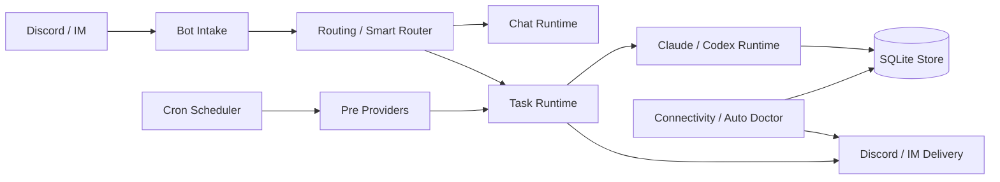

# Architecture

MiniClaw's repo docs remain the implementation source of truth. This website page is a human-facing architecture summary with links back to the canonical docs and the current Chinese mirror.
