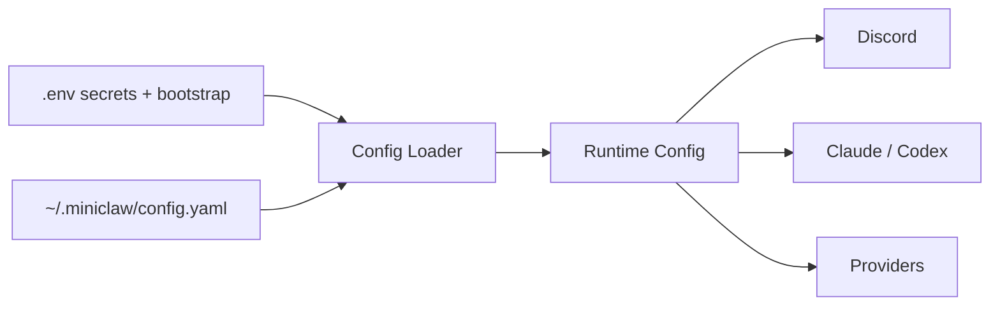

# Getting Started

MiniClaw is meant to run as a local personal service. The website keeps the path short; the linked runbooks hold the full setup, troubleshooting, distribution, and release-boundary details.

```bash
git clone https://github.com/yuanyunfan/miniclaw.git
cd miniclaw
./install.sh
pnpm run setup
pnpm run doctor:setup
pnpm register
pnpm dev
```

## First Run Checklist

- **Install dependencies**: `./install.sh` prepares the local project without writing real tokens.
- **Create local config**: `pnpm run setup` writes `.env` and `~/.miniclaw/config.yaml`, backing up existing files.
- **Register Discord commands**: `pnpm register` syncs slash commands for the configured guild.
- **Start the runtime**: `pnpm dev` runs the bot through the TypeScript watcher.
- **Verify in Discord**: `/health` checks runtime health; `@MiniClaw hello` checks chat intake.
- **Promote to PM2 later**: use the release/deploy runbooks after the first local bot path is healthy.

## Configuration Model



Use `~/.miniclaw/` for personal config and state. Keep repo files reusable, reviewable, and free of credentials; advanced provider and cron setup belongs after the minimal bot is working.
