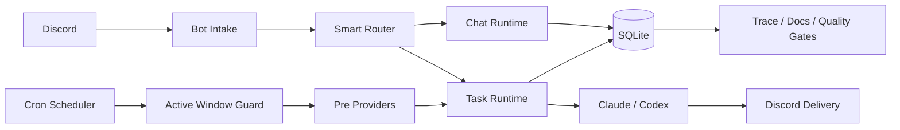
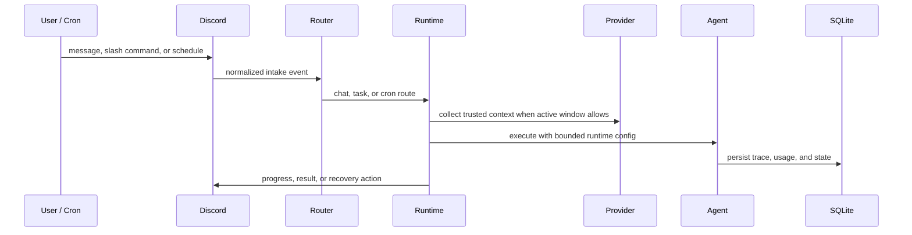

# MiniClaw

MiniClaw is a local-first automation runtime that turns Discord messages, cron schedules, read-only providers, and Claude/Codex agents into one observable personal operations loop. The website is a curated portal; the implementation contract stays in the repo docs.

## System Design

## Design Surface

- **Discord-native control plane**: chat, task intake, slash commands, cron reports, and failure recovery all land in Discord.
- **Runtime boundary**: MiniClaw owns routing, context, progress, trace events, and delivery; Claude/Codex own agent execution.
- **Operator visibility**: task traces, cron run history, read-only doctor reports, and incident workflows are first-class slash-command surfaces.
- **Provider-first reports**: content, email, stock, watchlist, pulse, and market-intel providers produce structured context before the LLM summarizes anything, after scheduled cron passes the global active-window guard.
- **Local-first state**: user config, secrets, provider sessions, cron state, and SQLite data live outside the public repo.
- **Docs-driven governance**: English repo docs are the canonical implementation record; Chinese docs mirror them with source-hash parity.
- **Quality as architecture**: docs drift, website drift, bilingual parity, changelog drift, coverage, secrets, and cron E2E are executable gates.

## Runtime Loop

## Operating Model

- **Architecture** maps the system boundaries and data movement.
- **Runtime** explains intake, routing, task execution, memory, cron, and recovery.
- **Providers** describes the readonly data collection layer and provider families.
- **Getting Started** keeps the first local run short and points deeper setup back to repo docs.
- **Quality Gates** shows how MiniClaw prevents docs, website, tests, and release checks from drifting.
