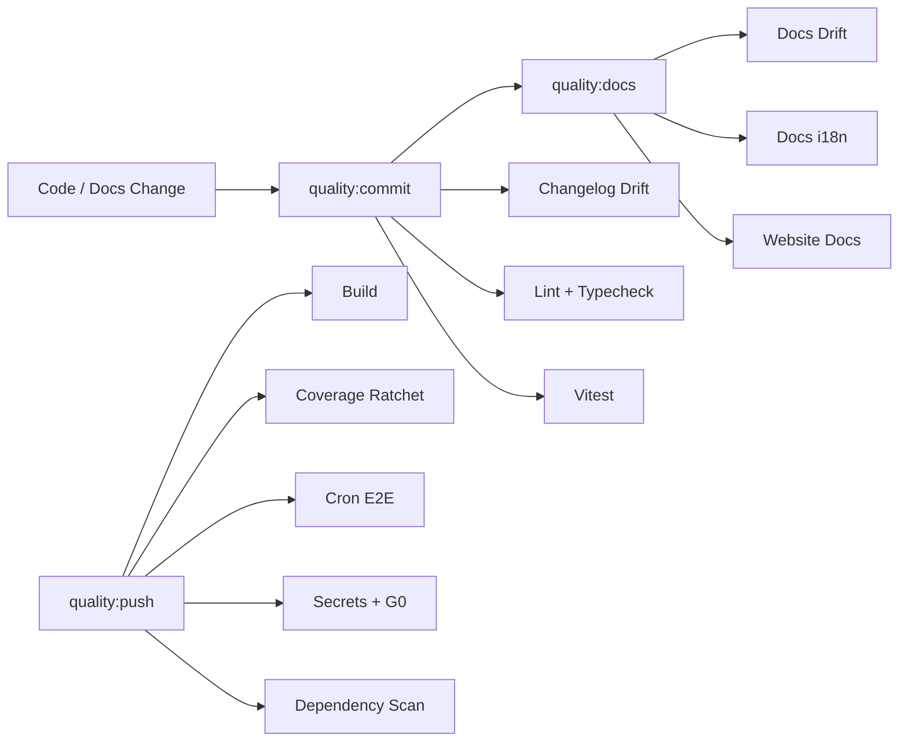
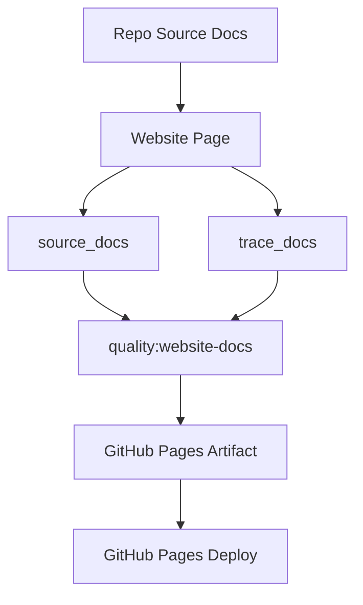

# Quality Gates

MiniClaw treats quality gates as part of the architecture. They protect runtime behavior, docs, website summaries, bilingual parity, changelog hygiene, secrets, and release safety.

## Drift Controls

- **`quality:docs:drift`** checks implementation-to-docs invariants.
- **`quality:docs-i18n`** checks bilingual doc pairing, metadata, heading shape, language split, and source-hash parity.
- **`quality:website-docs`** keeps website summaries tied to repo docs without forcing internal implementation updates into public copy.
- **`quality:changelog`** blocks release-visible changes that do not update `CHANGELOG.md`.
- **`quality:commit`** is the staged gate for normal local commits.
- **`quality:push`** expands into build, coverage, cron E2E, full-tree safety, secrets, and dependency checks.

## Website Contract

The Pages workflow builds and validates the site every time. Source changes that alter public summaries should update website pages; trace-only changes are reported for review without blocking the site.
