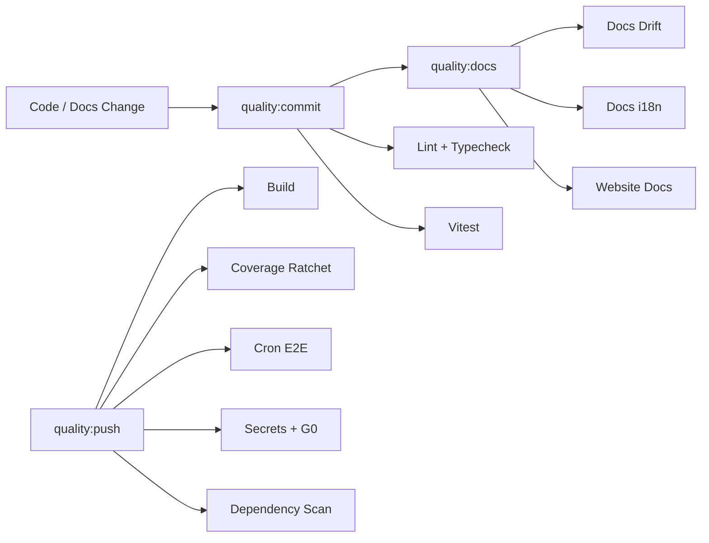
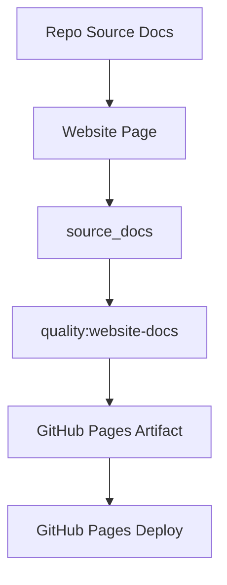

# Quality Gates

MiniClaw treats quality gates as part of the architecture. They protect runtime behavior, docs, website summaries, bilingual parity, secrets, and release safety.

## Drift Controls

- **`quality:docs:drift`** checks implementation-to-docs invariants.
- **`quality:docs-i18n`** checks bilingual doc pairing, metadata, and current translation parity.
- **`quality:website-docs`** checks website `source_docs` traceability and affected-page updates.
- **`quality:commit`** is the staged gate for normal local commits.
- **`quality:push`** expands into build, coverage, cron E2E, full-tree safety, secrets, and dependency checks.

## Website Contract

The Pages workflow builds and validates the site every time. Deployment runs when GitHub Pages is enabled for the repository; otherwise the workflow uploads the built artifact for review.
