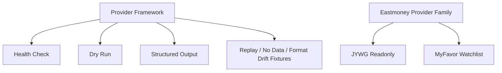

# Providers

Providers 为 cron、task 和 research workflow 准备可信上下文。迁移计划要求 provider contract 保留在 repo docs 中，网站只展示整理后的摘要。

```mermaid
flowchart TD
  ProviderFramework[Provider Framework] --> Health[Health Check]
  ProviderFramework --> DryRun[Dry Run]
  ProviderFramework --> Output[Structured Output]
  ProviderFramework --> Fixtures[Replay / No Data / Format Drift Fixtures]
  Eastmoney[Eastmoney Provider Family] --> JYWG[JYWG Readonly]
  Eastmoney --> MyFavor[MyFavor Watchlist]
```
