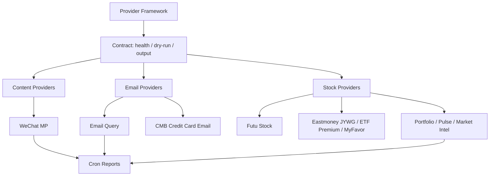
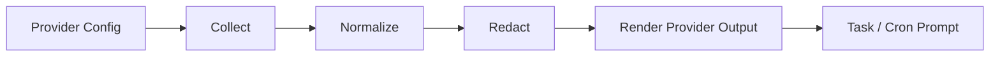

# Providers

Providers 是只读 context collectors。它们在 agent prompt 之前运行，把外部数据转换成结构化文本，并把 account-specific state 留在公开 repo 之外。

## Provider 原则

- **Readonly first**：provider docs 和代码必须明确 mutation boundary。
- **Structured before summarized**：providers 负责采集事实；LLM 负责解释和写报告。
- **Session isolation**：cookies、app passwords、brokerage sessions 和 account state 留在 `~/.miniclaw/`。
- **Replayable failures**：no-data、auth-expired、format-drift 场景需要 fixture 或 dry-run 覆盖。
- **Family docs over legacy stubs**：provider contract 现在维护在 `docs/providers/`；旧 feature stubs 已完成合并并删除。

## Context Shape

website 展示 provider map；实现 contract、provider-specific setup 和容易漂移的细节继续留在 linked source docs。

股票组合报告可以把 Eastmoney JYWG 的持仓证据和 Eastmoney fund selector 的 public ETF premium evidence 合并使用。public premium source 只按代码 enrich 已持仓 ETF，不能被当成 account holdings proof。
