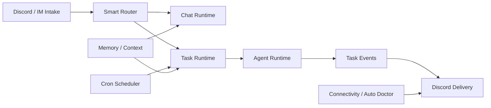

# Runtime

MiniClaw runtime 连接 Discord intake、Smart Router decisions、cron tasks、managed agent execution、memory/context 和 recovery operations。

网站只保留面向人的运行时地图；实现规则、owner paths 和高 drift contracts 维护在 repo runtime docs 中。
