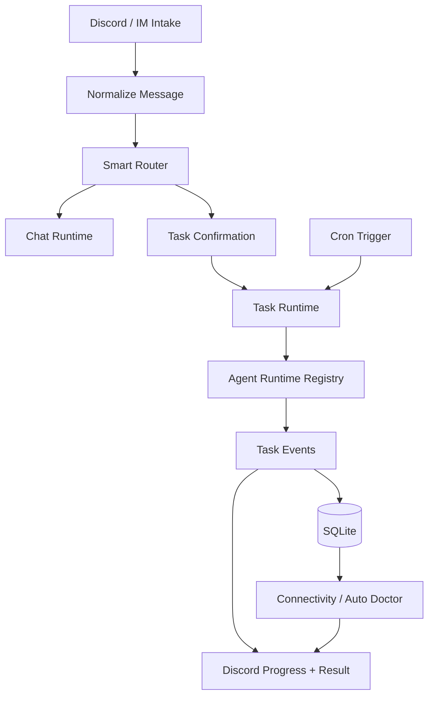
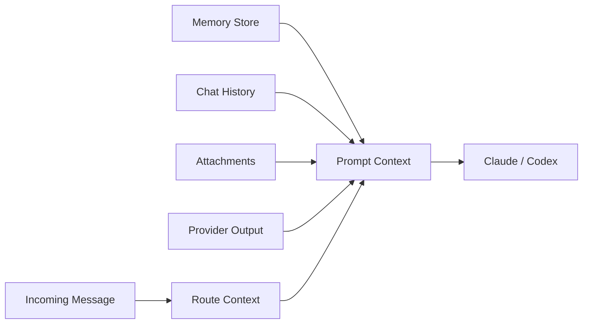

# Runtime

Runtime 把 intake event 转成有边界的 chat response、managed task thread，或者由 provider 驱动的 scheduled report。同一套 event model 同时进入 trace storage 和 recovery。

## Runtime 职责

- **Intake normalization**：Discord events 被整理成一致的 route input。
- **Routing semantics**：Smart Router 区分 chat、suggested task、confirmed task 和受信 auto-task channel。
- **Task lifecycle**：task threads、progress cards、tool traces、final Markdown output、cancellation 和 resume 都属于 runtime。
- **Discord delivery**：长 Markdown 结果会切成 Discord 尺寸的消息；`<https://...>` 链接会保留 Discord no-preview 行为，让链接很多的 cron report 仍然可读。
- **Cron execution**：cron jobs 可以先收集 provider output，再创建 agent prompt。
- **Recovery loop**：connectivity 和 doctor repair 复用 stored incidents 与 trace evidence。
- **Merged runtime docs**：feature-level runtime notes 已合并到 runtime source docs。

## Context Assembly

runtime docs 维护实现细节和 owner paths；website 只保留读者理解系统流动所需的稳定模型。
