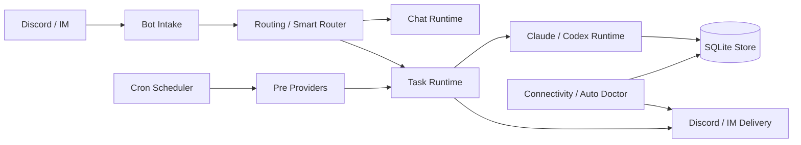

# 架构

repo 内 `docs/` 仍是 implementation source of truth。这个网站页面只提供面向人的高层架构摘要，并回链到 canonical docs 与 current 中文 mirror。

历史 feature 文档现在统一归档到 `docs/archive/features/`；当前实现事实由 runtime、provider、experiment 和 reference 文档维护。
