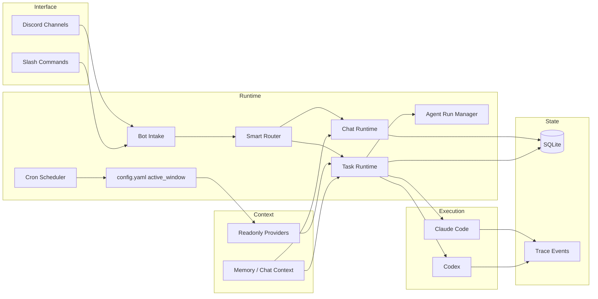
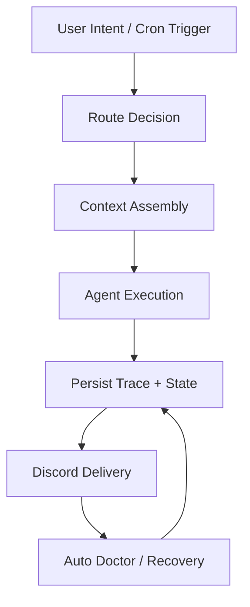

# Architecture

MiniClaw 的核心边界是：Discord 是 control 和 delivery surface；本地 runtime 负责 routing、provider context、task execution、storage、recovery 和 quality traceability。用户状态留在 `~/.miniclaw/`，实现事实留在 `docs/`。

## 边界图

- **Interface boundary**：Discord 承载用户意图、执行进度、最终输出和 operator actions。
- **Runtime boundary**：routing、task lifecycle、可选 Agent Run Manager orchestration、cron active-window guard 和 recovery logic 留在 MiniClaw。
- **Provider boundary**：外部账户只作为 read-only context source；secrets 和 sessions 不进入 Git。
- **Execution boundary**：Claude/Codex 执行任务，但 session、usage、trace events 和 delivery 由 MiniClaw 统一。
- **Docs boundary**：英文 repo docs 是 canonical source；中文 mirror 和 website pages 都通过 gate 跟随它。

## 数据流动

历史 feature stubs 已完成合并并删除。当前实现事实应写入 runtime、provider、experiment 和 reference docs，再通过 `source_docs` 流入 website。
