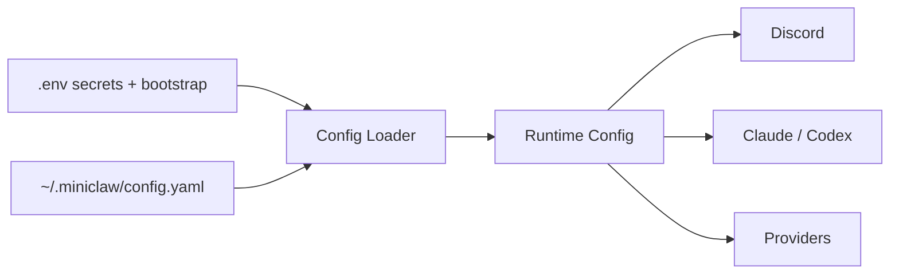

# Getting Started

MiniClaw 适合作为本地个人服务常驻运行。website 只保留最短路径；完整安装、排障、分发和 release boundary 继续维护在 linked runbooks 中。

```bash
git clone https://github.com/yuanyunfan/miniclaw.git
cd miniclaw
./install.sh
pnpm run setup
pnpm run doctor:setup
pnpm register
pnpm dev
```

## First Run Checklist

- **Install dependencies**：`./install.sh` 准备本地项目，不写入真实 tokens。
- **Create local config**：`pnpm run setup` 写入 `.env` 和 `~/.miniclaw/config.yaml`，并备份已有文件。
- **Register Discord commands**：`pnpm register` 同步配置 guild 的 slash commands。
- **Start the runtime**：`pnpm dev` 通过 TypeScript watcher 运行 bot。
- **Verify in Discord**：`/health` 检查 runtime health；`@MiniClaw hello` 检查 chat intake。
- **Promote to PM2 later**：first local bot path 健康后，再按 release/deploy runbooks 切到 PM2。

## Configuration Model



个人配置和运行态放在 `~/.miniclaw/`。repo 文件保持 reusable、reviewable，并且不包含 credentials；advanced provider 和 cron setup 应放在 minimal bot 跑通之后。
