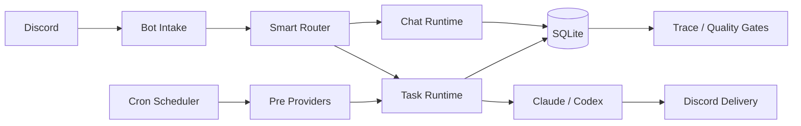
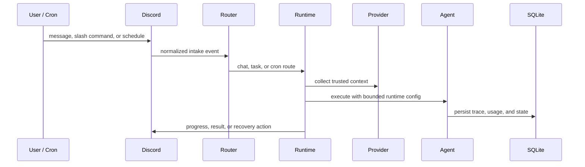

# MiniClaw

MiniClaw 是一个 local-first automation runtime，把 Discord 消息、cron 调度、只读 providers 和 Claude/Codex agents 组织成一条可观测的个人自动化工作流。

## 系统设计

## 设计边界

- **Discord-native control plane**：chat、task intake、slash commands、cron reports 和 failure recovery 都通过 Discord 交互和留痕。
- **Runtime boundary**：MiniClaw 负责 routing、context、progress、trace events 和 delivery；Claude/Codex 负责 agent execution。
- **Provider-first reports**：WeChat、email、stock、market providers 先生成结构化上下文，再交给 LLM 汇总。
- **Local-first state**：用户配置、secrets、provider sessions、cron state 和 SQLite 数据都留在公开 repo 之外。
- **Docs-driven governance**：repo docs 是实现记录；website 是面向人的入口，并回链到 current source docs。
- **Quality as architecture**：docs drift、website drift、i18n parity、coverage、secrets 和 cron E2E 都是可执行 gate。

## Runtime Loop

## 阅读路径

- **Architecture** 展示系统边界和数据流动。
- **Runtime** 解释 intake、routing、task execution、memory、cron 和 recovery。
- **Providers** 描述只读数据采集层以及 provider families。
- **Getting Started** 保持首次本地运行足够短，深入配置继续回到 repo docs。
- **Quality Gates** 展示 MiniClaw 如何防止 docs、website、tests 和 release checks 漂移。
