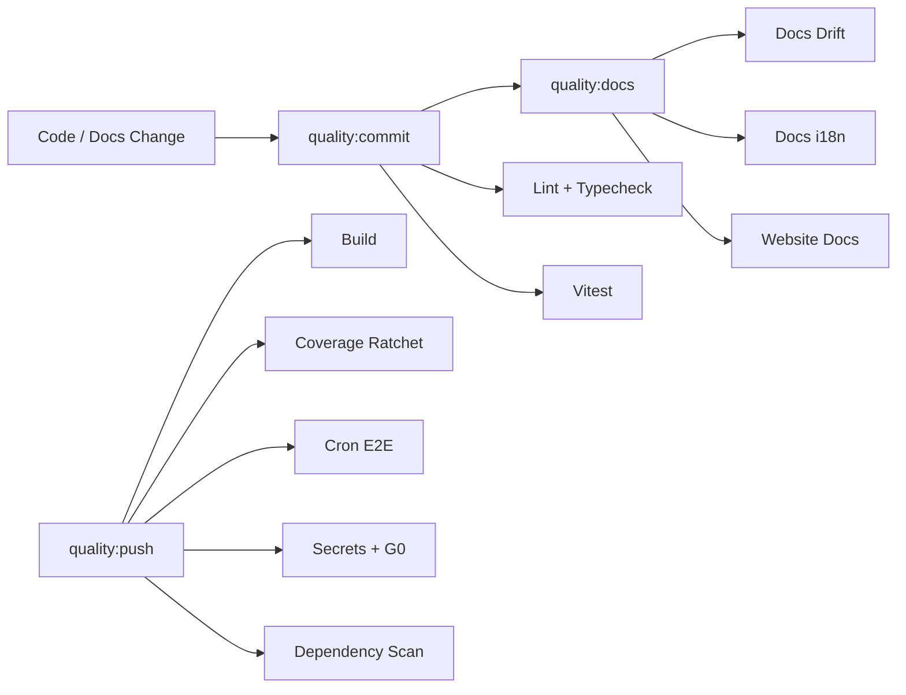
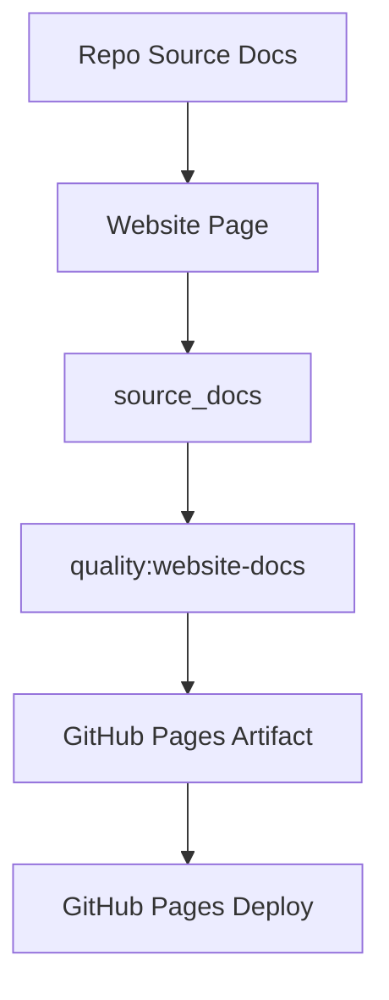

# Quality Gates

MiniClaw 把 quality gates 当成架构的一部分，用来保护 runtime behavior、docs、website summaries、bilingual parity、secrets 和 release safety。

## Drift Controls

- **`quality:docs:drift`** 检查 implementation-to-docs invariants。
- **`quality:docs-i18n`** 检查 bilingual doc pairing、metadata 和 current translation parity。
- **`quality:website-docs`** 检查 website `source_docs` traceability 和 affected-page updates。
- **`quality:commit`** 是本地 commit 前的 staged gate。
- **`quality:push`** 扩展到 build、coverage、cron E2E、full-tree safety、secrets 和 dependency checks。

## Website Contract

Pages workflow 每次都会 build 和 validate；当仓库启用 GitHub Pages 后才 deploy，否则上传已构建的 website artifact 供 review。
