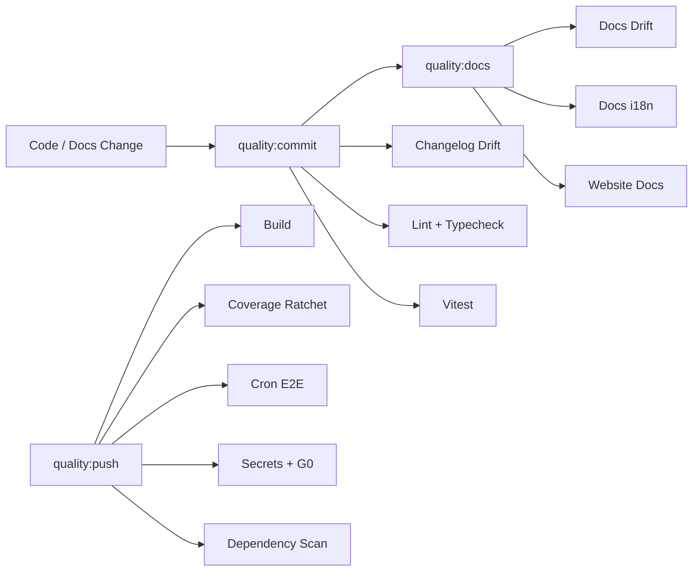
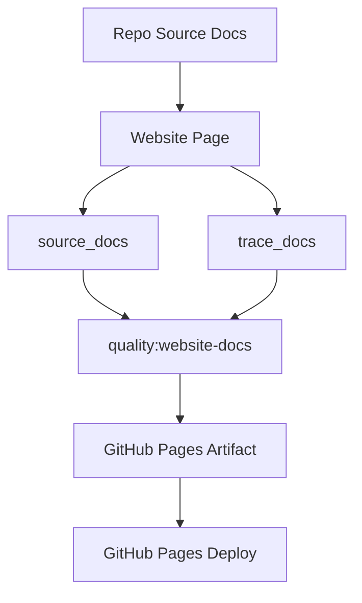

# Quality Gates

MiniClaw 把 quality gates 当成架构的一部分，用来保护 runtime behavior、docs、website summaries、bilingual parity、changelog hygiene、secrets 和 release safety。

## Drift Controls

- **`quality:docs:drift`** 检查 implementation-to-docs invariants。
- **`quality:docs-i18n`** 检查 bilingual doc pairing、metadata、heading shape、language split 和 source-hash parity。
- **`quality:website-docs`** 让 website summaries 继续关联 repo docs，但不把内部实现更新强行写进 public copy。
- **`quality:changelog`** 阻止 release-visible 变更在未更新 `CHANGELOG.md` 时落地。
- **`quality:coverage`** 在 coverage run 后检查 ratcheted file thresholds；stock report thresholds 跟随 `src/stock/reports` ownership，而不是 provider compatibility facades。
- **`quality:commit`** 是本地 commit 前的 staged gate。
- **`quality:push`** 扩展到 build、coverage、cron E2E、full-tree safety、secrets 和 dependency checks。

## Website Contract

Pages workflow 每次都会 build 和 validate。会改变 public summary 的 source changes 应更新 website pages；trace-only changes 只提示 review，不阻塞 site。
